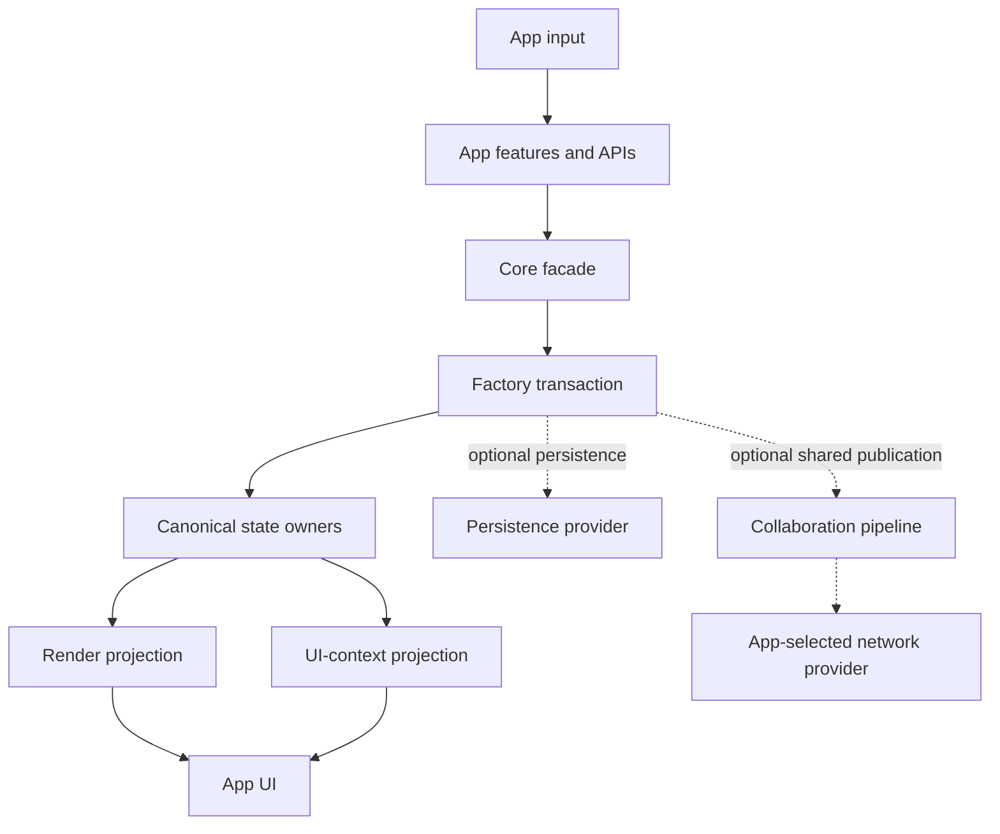

# Asyra

> **Asyra** — An information modeling framework for building interactive design applications, by defining yourself.

## Core Vision

- **Information Model First**: Defines what an information model should contain for interactive design apps.
- **Framework for Product Extension**: Provides modular building blocks so developers can define their own interactive products.
- **Modular and Customizable**: Developers have full control over how modules are combined and extended.

## Core Modules

1. **Core** coordinates lifecycle, registration, persistence, and package
   facades without owning app product decisions.
2. **Factory** owns transaction boundaries, rollback journals, undo/redo, and
   optional shared-action publication.
3. **Scene Tree, Props Manager, Selection, and System Context** own canonical
   document or runtime state in their respective domains.
4. **Reactive Events** carries typed communication without becoming a product
   state owner.
5. **Input System + Feature System** normalize app-defined input and coordinate
   deterministic feature sessions.
6. **Render + Render Engine** project canonical state through a replaceable
   rendering boundary.
7. **UI Context** projects framework/app state for UI consumers; presentation
   remains app-owned.
8. **Persistence** is a replaceable provider boundary used by Core.
9. **Collaboration** is optional. Apps that enable it explicitly compose the
   Yjs operation pipeline and a replaceable network provider; apps that omit it
   keep their ordinary load/save/backend path.
10. **Preset** installs optional official defaults. Apps may compose, replace,
    or omit those defaults.

## Architecture Overview

The app defines product behavior and backend policy. Framework packages run the
selected pipeline without inventing app operations, conflict semantics,
authorization, or UI behavior.

## Documentation

- Documentation map: [`docs/README.md`](docs/README.md)
- Framework contracts: [`docs/ai/framework/README.md`](docs/ai/framework/README.md)
- Release support: [`docs/ai/framework/RELEASE_SUPPORT.md`](docs/ai/framework/RELEASE_SUPPORT.md)
- App contracts: [`docs/ai/apps/README.md`](docs/ai/apps/README.md)
- Supported examples: [`docs/examples/README.md`](docs/examples/README.md)

## Release support

Framework `0.2.5` is the release-readiness candidate for the 19 public
`@asyra/*` packages. The formal environment is Node.js 24.x and Yarn 4.3.1.
The release supports the official 2D preset and engine-neutral CUSTOM
composition; production 3D, HYBRID, auto-layout, and unit-aware aggregation are
not available in this release.

See the [release support contract](docs/ai/framework/RELEASE_SUPPORT.md) for
the exact package set, TypeScript/React/browser support, public composition
paths, migration/deprecation guidance, artifact-only verification, and the
boundary between a `READY` audit and an authorized publication.

## 🤝 Contribution Policy

Asyra is an open-source project and is publicly available for reference, learning, and use.

However, this repository is **not accepting external contributions** at this time.
This includes pull requests, issues, and other forms of direct contribution.

The codebase is intentionally curated to serve as a **cohesive reference implementation**
for Communication-Driven Development (CDD) and AI-native workflows.

You are welcome to fork the project and adapt it for your own needs.

---

> Asyra is the evolution of Asra — consolidating previous experiences into a new, long-term vision.

## License

MIT
