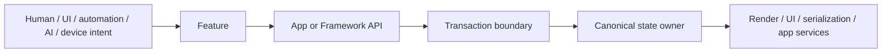

# Asyra

Asyra is deterministic, modular infrastructure for building declarative
information-modeling products. It gives an application explicit owners for
intent, transactions, canonical state, validation, registration, persistence
boundaries, and downstream projections without deciding what the application's
domain means.

## What Asyra is

Asyra is a Framework for products whose information must remain editable,
reversible, inspectable, persistable, and extensible as the product grows.
Human input, UI actions, automation, devices, and AI-issued commands enter the
same registered Feature and API boundaries instead of creating parallel state
paths.

The initial release is built around the verified browser/Core composition and
visual product paths. Asyra is not a canvas widget and is not limited to design
tools: it provides infrastructure that an App can compose around its own data,
rules, engines, services, and interfaces.

## Choose your starting point

### Start from a working product

Use [`create-asyra-design-app`](create-app/asyra-design/README.md) when you want
an immediately editable reference product. This is the recommended beginner
path for engineers, product builders, and non-engineers working with an AI
coding agent:

```bash
npx create-asyra-design-app my-product
cd my-product
yarn start
```

The generated project is ordinary source code. Continue by following its
bounded extension guide and the public Framework documentation.

### Learn the Framework

Use the [public documentation](docs/public/index.md) and Runtime Atlas to study
small owner flows without the complete Asyra Design service stack. The advanced
guides show copyable code, call locations, owner sequences, expected results,
and failure behavior for information models, Preset `2D`, `CUSTOM` rendering,
transactions, collaboration, app-owned migration, and registered AI actions.

### Build a custom product

Start with the [public documentation](docs/public/index.md) when you already
know the product you want to build. You may apply the complete official Preset,
select only the defaults you need, or compose Framework packages directly
through supported public entrypoints.

## Runtime model



Loading, undo/redo replay, and accepted remote changes are state-application
paths. They run through migration, validation, conflict policy, and canonical
apply owners; they do not invent a second product-decision runtime.

## Ownership boundary

- **Framework** owns deterministic runtime contracts, transaction and rollback
  boundaries, canonical state owners, validation, registration, and replaceable
  provider or output boundaries. It does not know the App's domain.
- **Preset** owns selectable official defaults and profile policy. The current
  catalog is design-tool-oriented because it is Asyra's public baseline, not
  because design behavior belongs in the Framework.
- **App** owns schemas, domain behavior, physical or business rules, workflows,
  permissions, search and index policy, backends, custom engines, and product
  UI.
- **Backend or external services** own their transport, authorization,
  durability, model-provider, and operational policy without becoming a second
  canonical product owner.

## Where Asyra can go

The same infrastructure can support a design tool, whiteboard, BIM system, VR
experience, industrial digital twin, 4D simulation, or a domain Asyra's authors
never anticipated. An industrial App could add its own physical and chemical
rules; a BIM App could add its own building model and safety policies; a
simulation App could bind a specialized engine. These are App-owned
possibilities, not turnkey capabilities bundled with Asyra.

The longer-term direction also includes non-visible information-model products
designed for AI retrieval and registered action execution. That direction is
important, but it is not a current public Headless Core or Core Kernel runtime.

## Current release and roadmap

The current Framework package manifests define the release candidates and
their exact package versions. The current release supports Node.js 24.x, Yarn
4.3.1, the official browser/Core composition, Preset `2D`, and engine-neutral
`CUSTOM` composition. Production `3D`, `HYBRID`, auto-layout, unit-aware
aggregation, public Headless Core, and a multi-runtime Core Kernel are future
work and must not be inferred from today's package import safety.

Publication still depends on the repository's release-readiness evidence; this
README does not independently authorize a release.

Versions, entrypoints, environments, migration guidance, and publication
status come from the
[Framework release support contract](docs/ai/framework/RELEASE_SUPPORT.md).
The [runtime-boundaries roadmap](docs/public/learn/runtime-boundaries-roadmap.md)
keeps verified capability separate from future direction.

## Documentation

- [Public documentation](docs/public/index.md) — Start, Learn, Build, Reference,
  and the Asyra Design case study.
- [Advanced build guides](docs/public/build/custom-schema.md) — public-API
  implementation patterns, owner flows, expected results, and failure paths.
- [Package reference](docs/public/reference/support-release.md) — support,
  migration, security, deprecation, and release boundaries.
- [Asyra Design](apps/asyra-design/README.md) — the real reference product and
  repository development path.
- [AI-readable discovery](docs/public/llms.txt) — stable public page inventory
  for retrieval and coding agents.
- [Framework architecture contracts](docs/ai/framework/README.md) — internal
  source-of-truth for Framework development.
- [Security policy](SECURITY.md) and [MIT License](LICENSE).

The interactive Asyra Runtime Atlas and official website are part of this
release program. Their public URLs will be added only after their deployment
owners verify them.

## Support and contribution policy

Asyra is publicly available for use, learning, inspection, and forking.
However, **This repository does not accept external issues or contributions**,
including pull requests, at this time. The codebase is intentionally curated as
one cohesive reference implementation for Communication-Driven Development and
AI-assisted workflows.

For security-sensitive reports, follow [SECURITY.md](SECURITY.md). For product
support boundaries, use the
[public support and release guide](docs/public/reference/support-release.md).

## License

[MIT](LICENSE)

---

Asyra is the evolution of Asra: previous experience consolidated into a new,
long-term Framework direction.
