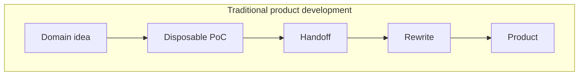
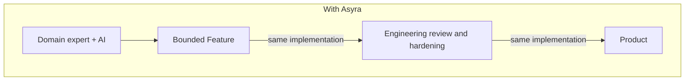
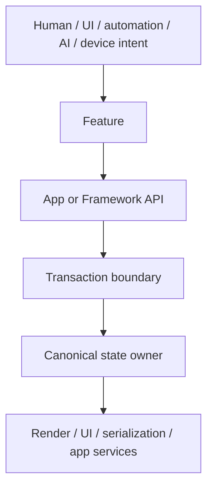

# Asyra

## Build product features, not infrastructure

Use Asyra to build canvas-based editors, whiteboards, BIM workspaces, industrial tools, simulations, and other domain products without coupling domain rules to one renderer or UI framework.

Asyra gives developers composable building blocks for turning domain-owned information and rules into products. Your App owns its schemas, rules, workflows, services, and UI. Asyra coordinates intent routing, registration, transactions, rollback, Undo/Redo, canonical state, validation, persistence boundaries, and downstream projections.

A Feature is an App-owned, registered unit of product behavior. It gives human input, UI, automation, devices, and AI-issued commands the same Feature and API boundaries instead of creating parallel product paths.

- **Focus on product behavior.** Build what makes the product valuable instead of rebuilding state, history, lifecycle, and integration plumbing for every capability.
- **Let the PoC become the product.** With AI-assisted development, domain experts, designers, and product teams can validate ideas directly against the product's real schemas, Features, and runtime boundaries. The result is reviewable source code on the actual product path, not a disposable prototype that engineers must rebuild later.
- **Change one explicit owner.** Add, replace, or remove a registered Feature without rewriting unrelated product paths, keeping the impact visible and technical debt local.
- **Reuse correctness infrastructure.** Features enter established transaction, validation, rollback, projection, and persistence boundaries instead of inventing parallel implementations.
- **Compose only what the product needs.** Preset defaults, render providers, persistence, collaboration, and AI remain selectable or replaceable instead of becoming mandatory product architecture.
- **Know what actually succeeded.** Runtime commit and durable persistence are separate observable states; supported local failures roll back instead of presenting partial state as success.

In a conventional application, one behavior may require coordinated changes across input handlers, UI state, history, rendering, persistence, and automation. With Asyra, a small Feature can remain a few focused lines of registration and domain code. Larger Features remain bounded to their explicit owners instead of spreading across dozens of unrelated files.

This changes the handoff inside a company. Non-engineers can prove domain workflows in the real product, while engineers review, harden, test, and extend the same implementation instead of translating a disconnected PoC into production code. A successful PoC already lives on the product path.





Asyra is a Framework for products whose information must remain editable, reversible, inspectable, persistable, and extensible as the product grows. It is not a canvas widget or a design-tool-only framework: an App composes Asyra around its own data, rules, engines, services, and interfaces.

## Try the demo

<a href="https://asyra-design.vercel.app/?fileId=demo" target="_blank" rel="noopener noreferrer">Asyra Design demo</a>

Asyra Design is a complete canvas-based design-tool product built with Asyra. It demonstrates how the Framework, official Preset, App-owned Features, editable information, rendering, Undo/Redo, and persistence fit together in a real product.

## Choose your starting point

### Start from Framework packages

`@asyra/core` is the package-first starting point. It does not impose a UI framework or predefined product behavior:

```bash
npm install @asyra/core
```

Asyra is published as 19 public `@asyra/*` ESM packages. Start with `@asyra/core`, then import and compose only the optional capabilities your product needs. Preset, Collaboration, AI, Design System, and concrete rendering providers remain optional.

Required package dependencies are installed automatically. Your App chooses the product capabilities, domain behavior, services, and interfaces that belong in the product. Core is the public composition facade for the current browser/Core runtime. The supported owner graph is documented in the [custom composition guide](docs/public/start/custom-composition.md).

Continue with the maintained guides that match the first behavior you want to build:

- [Model product information first](docs/public/learn/information-models.md)
- [Define an App-owned component and schema](docs/public/build/custom-schema.md)
- [Build a transaction-safe Feature](docs/public/build/feature-session.md)

This package-first path is the better starting point for experienced builders, non-design products, or ideas that should be composed deliberately.

### Start from a ready-to-use design tool

Use [`create-asyra-design-app`](create-app/asyra-design/README.md) to begin with an immediately editable design-tool product. Start with Asyra Design, then add, remove, or replace its Features, product behavior, services, and UI. It gives builders a working design-tool foundation without requiring them to compose every capability first:

```bash
npx create-asyra-design-app my-product --package-manager=npm
cd my-product
npm run start
```

The CLI supports Yarn, npm, or pnpm. It installs the project dependencies and prints the exact start command for the selected package manager.

The generated project is ordinary source code and includes documentation for both humans and AI coding agents. Continue with its bounded extension guide and the public Framework documentation.

## How Asyra works



Loading, Undo/Redo replay, and accepted remote changes are state-application paths. They run through migration, validation, conflict policy, and canonical apply owners; they do not invent a second product-decision runtime.

### Ownership boundaries

- **Framework** owns deterministic runtime contracts, transaction and rollback boundaries, canonical state owners, validation, registration, and replaceable provider or output boundaries. It does not know the App's domain.
- **Preset** owns selectable official defaults and profile policy. Its current catalog is design-tool-oriented because it is Asyra's public baseline, not because design behavior belongs in the Framework.
- **App** owns schemas, domain behavior, physical or business rules, workflows, permissions, search and index policy, backends, custom engines, and product UI.
- **Backend or external services** own transport, authorization, durability, model-provider, and operational policy without becoming a second canonical product owner.

## Where Asyra can go

The same infrastructure can support a design tool, whiteboard, BIM system, industrial digital twin, 4D simulation, or domains its authors never anticipated. For example:

- **Industrial products** can add their own physical and chemical rules.
- **BIM products** can add their own building models and safety policies.
- **Simulation products** can bind specialized engines.
- **Semiconductor fabrication plants** can encode manufacturing rules and process constraints to evaluate candidate process flows earlier and make validation more precise and consistent.
- **Your field** - bring the information, rules, and workflows you know best.

These possibilities belong to the App. Asyra does not bundle them as turnkey capabilities.

The longer-term direction also includes non-visible information-model products designed for AI retrieval and registered action execution. That direction is important, but it is not a current public Headless Core or Core Kernel runtime.

## Current support

Current public support covers Node.js 24.x, the browser/Core composition, the official `2D` Preset, and engine-neutral `CUSTOM` composition. Production `3D`, `HYBRID`, auto-layout, unit-aware aggregation, public Headless Core, and a multi-runtime Core Kernel are not current capabilities.

- [Public support and release guide](docs/public/reference/support-release.md) - environments, entrypoints, migration, security, and deprecation boundaries.
- [Runtime-boundaries roadmap](docs/public/learn/runtime-boundaries-roadmap.md) - verified capabilities and future direction.

## Documentation

- [Public documentation](docs/public/index.md) - Start, Concepts, Extend, Customize, Reference, and the Asyra Design case study.
- [Asyra Design case study](docs/public/cases/asyra-design.md) - how one complete product composes Framework infrastructure and App-owned behavior.
- [AI-readable discovery](docs/public/llms.txt) - the stable public page inventory for retrieval and coding agents.

## Support and contribution policy

Asyra is publicly available for use, learning, inspection, and forking.

**This repository does not accept external issues or contributions, including pull requests.**

The codebase is intentionally curated as one cohesive reference implementation for Communication-Driven Development and AI-assisted workflows.

For security-sensitive reports, follow [SECURITY.md](SECURITY.md).

## License

[MIT](LICENSE)
