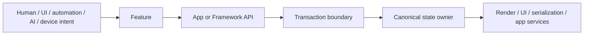

# Asyra

## Build product features, not infrastructure

Asyra provides the reusable infrastructure behind a product so developers can
focus on domain knowledge and Features. Your App owns its schemas, rules,
workflows, services, and UI. Asyra keeps intent routing, registration,
transactions, rollback, Undo/Redo, canonical state, validation, persistence
boundaries, and downstream projections consistent.

- **Focus on product behavior.** Build what makes the product valuable instead
  of rebuilding state, history, lifecycle, and integration plumbing for every
  capability.
- **Change one explicit owner.** Add, replace, or remove a registered Feature
  without rewriting unrelated product paths.
- **Reuse correctness infrastructure.** Features enter established transaction,
  validation, rollback, projection, and persistence boundaries instead of
  inventing parallel implementations.
- **Keep every actor on the same path.** Human input, UI, automation, devices,
  and AI-issued commands use the same Feature and API boundaries.
- **Compose only what the product needs.** Preset defaults, render providers,
  persistence, collaboration, and AI remain selectable or replaceable instead
  of becoming mandatory product architecture.
- **Know what actually succeeded.** Runtime commit and durable persistence are
  separate observable states; supported local failures roll back instead of
  presenting partial state as success.
- **Control technical debt.** Explicit ownership keeps the impact of a change
  visible and prevents product behavior from leaking across handlers, global
  stores, components, renderers, and backend adapters.

In a conventional application, one behavior may require coordinated changes to
input handlers, UI state, history, rendering, persistence, and automation. With
Asyra, a small Feature can remain a few focused lines of registration and
domain code; larger Features remain bounded to their explicit owners instead of
spreading across dozens of unrelated files.

## What Asyra is

Asyra is a Framework for products whose information must remain editable,
reversible, inspectable, persistable, and extensible as the product grows.
Human input, UI actions, automation, devices, and AI-issued commands enter the
same registered Feature and API boundaries instead of creating parallel state
paths.

The initial release is built around the verified browser/Core composition and
visual product paths. Asyra is not a canvas widget and is not limited to design
tools: it provides infrastructure that an App can compose around its own data,
rules, engines, services, and interfaces.

## Try the demo

[Asyra Design demo](https://asyra-karote00s-projects.vercel.app/?fileId=demo)
to explore a working product built with Asyra. Asyra Design is one complete
design-tool implementation: it demonstrates how the Framework, official
Preset, App-owned features, editable information, rendering, undo/redo, and
persistence fit together in a real product.

## Choose your starting point

### Start from Framework packages

Install `@asyra/core` when you want to compose a product from the ground up
without inheriting a UI framework or predefined product behavior:

```bash
npm install @asyra/core
```

Core is the public composition facade for the current browser/Core runtime.
Add only the Framework packages, providers, and App-owned behavior your product
needs, then follow the
[custom composition guide](docs/public/start/custom-composition.md) for the
supported owner graph.

This is the better starting point for experienced builders, non-design
products, or ideas that should be composed deliberately from Asyra Framework
packages.

### Start from a ready-to-use design tool

Use [`create-asyra-design-app`](create-app/asyra-design/README.md) when you want
to build from an immediately editable design-tool product. Start with Asyra
Design, then add, remove, or replace its features, product behavior, services,
and UI to match your own design product. This is the product-first option for
builders who want a working design-tool foundation instead of composing every
capability first:

```bash
npx create-asyra-design-app my-product
cd my-product
yarn start
```

The generated project is ordinary source code and includes documentation for
both humans and AI coding agents. Continue by following its bounded extension
guide and the public Framework documentation.

### Learn the Framework

Use the [public documentation](docs/public/index.md) and Runtime Atlas to study
small owner flows without the complete Asyra Design service stack. The advanced
guides show copyable code, call locations, owner sequences, expected results,
and failure behavior for information models, Preset `2D`, `CUSTOM` rendering,
transactions, collaboration, app-owned migration, and registered AI actions.

### Build a custom product

Start with the [public documentation](docs/public/index.md) when you already
know the product you want to build. You may apply the complete official Preset,
select only the defaults you need, or compose Framework packages directly
through supported public entrypoints.

## Runtime model



Loading, undo/redo replay, and accepted remote changes are state-application
paths. They run through migration, validation, conflict policy, and canonical
apply owners; they do not invent a second product-decision runtime.

## Ownership boundary

- **Framework** owns deterministic runtime contracts, transaction and rollback
  boundaries, canonical state owners, validation, registration, and replaceable
  provider or output boundaries. It does not know the App's domain.
- **Preset** owns selectable official defaults and profile policy. The current
  catalog is design-tool-oriented because it is Asyra's public baseline, not
  because design behavior belongs in the Framework.
- **App** owns schemas, domain behavior, physical or business rules, workflows,
  permissions, search and index policy, backends, custom engines, and product
  UI.
- **Backend or external services** own their transport, authorization,
  durability, model-provider, and operational policy without becoming a second
  canonical product owner.

## Where Asyra can go

The same infrastructure can support a design tool, whiteboard, BIM system,
industrial digital twin, 4D simulation, or a domain Asyra's authors never
anticipated. An industrial App could add its own physical and chemical rules;
a BIM App could add its own building model and safety policies; a simulation
App could bind a specialized engine. A semiconductor manufacturer such as TSMC
could encode its own chip-fabrication rules and process constraints in an App
to evaluate candidate process flows earlier and make validation more precise
and consistent. These are App-owned possibilities, not turnkey capabilities
bundled with Asyra.

The longer-term direction also includes non-visible information-model products
designed for AI retrieval and registered action execution. That direction is
important, but it is not a current public Headless Core or Core Kernel runtime.

## Current release and roadmap

The current Framework package manifests define the release candidates and
their exact package versions. The current release supports Node.js 24.x, Yarn
4.3.1, the official browser/Core composition, Preset `2D`, and engine-neutral
`CUSTOM` composition. Production `3D`, `HYBRID`, auto-layout, unit-aware
aggregation, public Headless Core, and a multi-runtime Core Kernel are future
work and must not be inferred from today's package import safety.

Publication still depends on the repository's release-readiness evidence; this
README does not independently authorize a release.

Versions, entrypoints, environments, migration guidance, and publication
status come from the
[Framework release support contract](docs/ai/framework/RELEASE_SUPPORT.md).
The [runtime-boundaries roadmap](docs/public/learn/runtime-boundaries-roadmap.md)
keeps verified capability separate from future direction.

## Documentation

- [Public documentation](docs/public/index.md) — Start, Learn, Build, Reference,
  and the Asyra Design case study.
- [Advanced build guides](docs/public/build/custom-schema.md) — public-API
  implementation patterns, owner flows, expected results, and failure paths.
- [Package reference](docs/public/reference/support-release.md) — support,
  migration, security, deprecation, and release boundaries.
- [Custom Framework composition](docs/public/start/custom-composition.md) —
  package-first composition and supported public owner boundaries.
- [Asyra Design](apps/asyra-design/README.md) — a complete, ready-to-use
  design-tool product and its repository development path.
- [AI-readable discovery](docs/public/llms.txt) — stable public page inventory
  for retrieval and coding agents.
- [Framework architecture contracts](docs/ai/framework/README.md) — internal
  source-of-truth for Framework development.
- [Security policy](SECURITY.md) and [MIT License](LICENSE).

The interactive Asyra Runtime Atlas and official website are part of this
release program. Their public URLs will be added only after their deployment
owners verify them.

## Support and contribution policy

Asyra is publicly available for use, learning, inspection, and forking.
However, **This repository does not accept external issues or contributions**,
including pull requests, at this time. The codebase is intentionally curated as
one cohesive reference implementation for Communication-Driven Development and
AI-assisted workflows.

For security-sensitive reports, follow [SECURITY.md](SECURITY.md). For product
support boundaries, use the
[public support and release guide](docs/public/reference/support-release.md).

## License

[MIT](LICENSE)

---

Asyra is the evolution of Asra: previous experience consolidated into a new,
long-term Framework direction.
