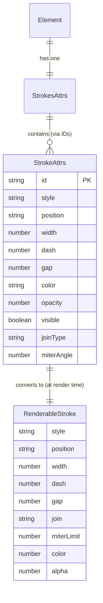

# 02 — Data Model

This chapter defines the data structures that back the stroke system.

## StrokeAttrs — The Single Stroke Record

**Location**: `packages/utils/src/propsManager/strokes.ts`

```typescript
interface StrokeAttrs extends BasePropertyAttrs {
  style: StrokeStyle          // 'solid' | 'dashed'
  position: StrokePosition    // 'center' | 'inside' | 'outside'
  width: number               // Stroke thickness (px)
  dash: number                // Dash length (px, for dashed style)
  gap: number                 // Gap length (px, for dashed style)
  defaultColorFormat: FillColorFormat  // Default format for color display
  colorFormat: FillColorFormat         // Current format for color display
  color: string               // Color value (hex string, e.g. '#000000')
  opacity: number             // 0–1
  visible: boolean            // Whether the stroke is rendered
  joinType: StrokeJoinType    // 'miter' | 'bevel' | 'round'
  miterAngle: number          // Miter angle in degrees (0–180)
}
```

`BasePropertyAttrs` provides:
```typescript
interface BasePropertyAttrs {
  id: string   // Unique property ID assigned by the core
  type: string // Property type identifier (e.g. 'stroke')
}
```

## Default Values

```typescript
const createDefaultStroke = (overrides = {}) => ({
  id: '',
  type: 'stroke',
  style: 'solid',
  position: 'center',
  width: 1,
  dash: 20,
  gap: 20,
  defaultColorFormat: 'hex',
  colorFormat: 'hex',
  color: '#000000',
  opacity: 1,
  visible: true,
  joinType: 'miter',
  miterAngle: 28.96,
  ...overrides
})
```

## Enum Constants

**Location**: `packages/utils/src/propsManager/strokes.ts`

```typescript
const StrokeStyles = { SOLID: 'solid', DASHED: 'dashed' }
const StrokePositions = { CENTER: 'center', INSIDE: 'inside', OUTSIDE: 'outside' }
const StrokeJoinTypes = { MITER: 'miter', BEVEL: 'bevel', ROUND: 'round' }
```

## StrokeRowAttrs — UI Display Row

```typescript
interface StrokeRowAttrs extends Omit<StrokeAttrs, 'id'> {
  ids: string[]  // Can hold multiple IDs for multi-selection aggregation
}
```

This is what the UI hooks (`useStrokes`, `useStroke`) return. The `ids` array supports future multi-selection merging.

## StrokesAttrs — Parent Container

```typescript
interface StrokesAttrs extends BasePropertyAttrs {
  strokes: string[]  // Array of child stroke property IDs
}
```

Each element has a single `strokes` property of type `STROKES`, which contains an array of stroke IDs. Each stroke ID references a child property of type `STROKE`.

## PropertyTypes

**Location**: `packages/utils/src/propsManager/enum.ts`

```typescript
const PropertyTypes = {
  STROKE: 'stroke',    // Individual stroke property
  STROKES: 'strokes',  // Container for stroke list
  // ... other property types
}
```

## Writable Fields (Patch Keys)

**Location**: `apps/asyra-design/src/constants/strokes.ts`

```typescript
type StrokeWritableKey = Exclude<keyof StrokeAttrs, 'id'>

const STROKE_PATCH_KEYS = [
  'style', 'position', 'width', 'dash', 'gap',
  'defaultColorFormat', 'colorFormat', 'color',
  'opacity', 'visible', 'joinType', 'miterAngle'
] as const
```

These are all the keys that a UI interaction can modify on a stroke. The `id` field is immutable.

## StrokePatch — Partial Update Object

**Location**: `apps/asyra-design/src/common-apis/strokes.ts`

```typescript
type StrokePatch = Partial<Pick<StrokeAttrs, StrokeWritableKey>>
```

A `StrokePatch` is what gets sent from the UI handlers to the API layer. It only contains the changed fields.

## RenderableStroke — Render-Ready Object

**Location**: `packages/preset/src/components/strokes.ts`

```typescript
interface RenderableStroke {
  style: 'solid' | 'dashed'
  position: 'center' | 'inside' | 'outside'
  width: number
  dash: number
  gap: number
  join: 'miter' | 'bevel' | 'round'
  miterLimit: number     // Computed from miterAngle
  cap: 'round'           // Always 'round' (hardcoded)
  color: number          // Integer color (0xRRGGBB)
  alpha: number          // Computed from color alpha × opacity
}
```

During rendering, `StrokeAttrs` is converted to `RenderableStroke`:
- `joinType` → `join` (renamed)
- `miterAngle` → `miterLimit` (via `1 / sin(angle/2)`)
- `color` (hex string) → `color` (integer via `rgbaToColorInt`)
- `opacity` × color alpha → `alpha` (via `clampOpacity`)

Non-renderable strokes (invisible or zero-width) are filtered out by `getRenderableStroke`.

## Data Relationship Diagram


