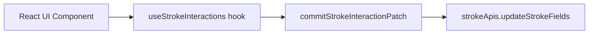

# 03 — UI to API Flow

This chapter traces the complete path from a user interaction in the UI to the API call that initiates the data change.

## Architecture Overview



## Step-by-Step: Modifying a Stroke Property

Let's trace what happens when a user changes the stroke width from `1` to `5`.

### Step 1: User types "5" into the Width input

**File**: `stroke.tsx` (line ~253)

The `<Input>` component fires its `onChange` callback, which points to `handleWidthChange`.

### Step 2: `handleWidthChange` validates and parses

**File**: `use-stroke-interactions.ts` (line ~313)

```typescript
const handleWidthChange = (value: string): boolean => {
  const parsed = parseFiniteInputNumber(value)  // Parse "5" → 5
  if (parsed === null) return false              // Guard: not a valid number

  const nextWidth = Math.max(0, parsed)          // Clamp: ensure ≥ 0
  if (!stroke || isEqual(stroke.width, nextWidth)) return false  // Guard: no change

  commitStrokeInteractionPatch({ width: nextWidth })  // Send patch
  return true
}
```

**What this does**:
1. Parses the raw input string into a finite number.
2. Clamps the value to valid range (≥ 0).
3. Checks if the value actually changed (de-duplication guard).
4. Creates a `StrokePatch` containing only the changed field: `{ width: 5 }`.

### Step 3: `commitStrokeInteractionPatch` decides the transaction mode

**File**: `use-stroke-interactions.ts` (line ~125)

```typescript
const commitStrokeInteractionPatch = (patch, options?, sourceStroke?) => {
  if (colorPickerTransactionRef.current) {
    // If a color picker drag is in progress, commit without wrapping
    commitStrokePatch(patch, options, sourceStroke)
    return
  }

  // Otherwise, wrap in a discrete transaction
  runDiscreteStrokeInteraction(() => {
    commitStrokePatch(patch, options, sourceStroke)
  })
}
```

**What this does**:
- For **discrete interactions** (text input, dropdown change, toggle): wraps the write in `startTransaction()` / `endTransaction()` to create a single undo entry.
- For **continuous interactions** (color picker drag): the transaction was already started by `handleColorPickerChangeStart`, so it just appends.

### Step 4: `runDiscreteStrokeInteraction` wraps in a transaction

**File**: `use-stroke-interactions.ts` (line ~116)

```typescript
const runDiscreteStrokeInteraction = (callback) => {
  transactionApis.startTransaction()
  try {
    callback()
  } finally {
    transactionApis.endTransaction()
  }
}
```

**What this does**: Ensures the property write is recorded as a single undoable operation in the undo/redo history.

### Step 5: `commitStrokePatch` calls the API

**File**: `use-stroke-interactions.ts` (line ~97)

```typescript
const commitStrokePatch = (patch, options?, sourceStroke?) => {
  const currentStroke = sourceStroke ?? stroke
  if (!currentStroke || !ownerElementId || !hasStrokePatch(patch)) return

  strokeApis.updateStrokeFields(
    ownerElementId,   // e.g. "rect_0"
    strokeId,         // e.g. "stroke_0"
    currentStroke,    // current full StrokeAttrs
    patch,            // { width: 5 }
    options           // e.g. { undoable: false } for drag
  )
}
```

**What this does**: Forwards the patch to the stroke API layer along with the owner element ID, stroke property ID, and the current stroke state (for diff computation).

---

## All Handler Flows

Below is a reference for every handler in `useStrokeInteractions`:

| Handler | UI Trigger | Patch Created | Transaction Mode |
|---------|-----------|---------------|-----------------|
| `handleVisibleChange` | Eye toggle click | `{ visible: boolean }` | Discrete |
| `handleOpacityChange` | Opacity input | `{ opacity: number }` | Discrete |
| `handleFormatChange` | Color format selector | `{ colorFormat: string }` | Discrete |
| `handleColorValueChange` | Color hex input | `{ color: string }` | Discrete |
| `handleColorPickerChange` | ColorPicker drag/click | `{ color, opacity }` | Depends on context |
| `handleColorPickerChangeStart` | ColorPicker drag start | *(opens transaction)* | Starts long transaction |
| `handleColorPickerChangeEnd` | ColorPicker drag end | `{ color, opacity }` (net) | Ends long transaction |
| `handleStyleChange` | Style dropdown | `{ style: string }` | Discrete |
| `handlePositionChange` | Position dropdown | `{ position: string }` | Discrete |
| `handleWidthChange` | Width input | `{ width: number }` | Discrete |
| `handleDashChange` | Dash input | `{ dash: number }` | Discrete |
| `handleGapChange` | Gap input | `{ gap: number }` | Discrete |
| `handleJoinTypeChange` | Join Type dropdown | `{ joinType: string }` | Discrete |
| `handleMiterAngleChange` | Miter Angle input | `{ miterAngle: number }` | Discrete |

---

## Color Picker: Long Transaction Flow (Detailed)

The color picker uses a special "long transaction" pattern to batch many rapid changes into a single undo entry.

### Drag Start

```typescript
handleColorPickerChangeStart = () => {
  pickerStartStrokeRef.current = currentStroke   // Snapshot the starting state
  pickerLatestStrokeRef.current = currentStroke
  startStrokeInteractionTransaction()            // Opens transaction
}
```

### During Drag (many calls)

```typescript
handleColorPickerChange = ({ color, opacity }) => {
  if (colorPickerTransactionRef.current) {
    // Inside long transaction: writes are NON-undoable
    writePickerStroke(color, opacity, { undoable: false })
    return
  }
  // Standalone click: wraps in discrete transaction
  runDiscreteStrokeInteraction(() => {
    writePickerStroke(color, opacity)
  })
}
```

### Drag End

```typescript
handleColorPickerChangeEnd = ({ color, opacity }) => {
  // 1. Compute the net change from start → end
  const finalPatch = createPickerPatch(startStroke, color, opacity)

  // 2. Reverse the last intermediate state (non-undoable)
  commitStrokePatch(reversePatch, { undoable: false }, finalStroke)

  // 3. Apply the net change from the original start state (undoable)
  commitStrokePatch(finalPatch, undefined, startStroke)

  // 4. Close the transaction
  endStrokeInteractionTransaction()
}
```

**Why this pattern?**
- During a drag, many intermediate values are written to the canvas (for real-time preview) but they should NOT create individual undo entries.
- At the end, the system "replays" the net change as a single undoable operation: `start state → final state`.

---

## Add / Remove Stroke Flow

Adding and removing strokes follows a different path because it modifies the **stroke list** (the parent `STROKES` property), not individual stroke fields.

### Add Stroke

**File**: `index.tsx` (line ~20)

```typescript
const handleAddStroke = () => {
  const nextStrokes = [
    ...strokes.map((stroke) => stroke.ids[0]),  // Existing stroke IDs
    createDefaultStroke()                        // New stroke object (no ID yet)
  ]
  writeStrokes(nextStrokes)
}
```

```typescript
const writeStrokes = (nextStrokes) => {
  changeElementComputedData('strokes', nextStrokes)
}
```

**What this does**:
1. Collects existing stroke IDs (strings).
2. Appends a new `createDefaultStroke()` object (which has `id: ''`).
3. Calls `changeElementComputedData('strokes', [...ids, newObject])`.
4. The core framework receives this mixed array and uses the `strokes-component.ts` definition's `children.mode: 'ids-or-objects'` to handle it — string entries reference existing children, object entries create new children.

### Remove Stroke

**File**: `index.tsx` (line ~28)

```typescript
const handleRemoveStroke = (index: number) => {
  const nextStrokes = strokes
    .filter((_, currentIndex) => currentIndex !== index)
    .map((stroke) => stroke.ids[0])
  writeStrokes(nextStrokes)
}
```

**What this does**: Filters out the stroke at the target index, collects remaining IDs, and writes the pruned array.
