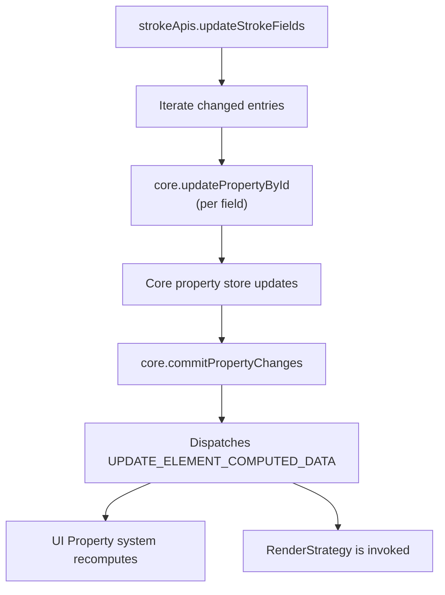
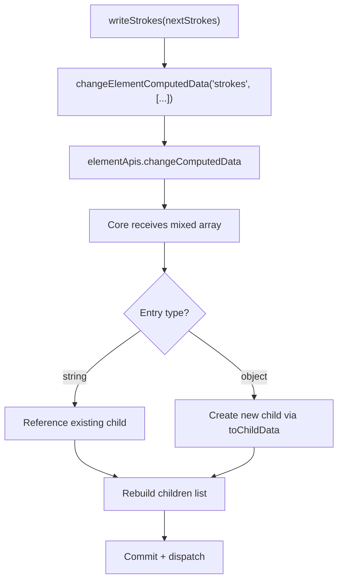

# 04 — API to Core Flow

This chapter traces the path from the stroke API layer down into the core framework's property system.

## Architecture Overview



## Step-by-Step: API Write

Continuing from the previous chapter — after `commitStrokePatch` calls `strokeApis.updateStrokeFields`:

### Step 1: `updateStrokeFields` computes the diff

**File**: `apps/asyra-design/src/common-apis/strokes.ts` (line ~28)

```typescript
updateStrokeFields: (elementId, strokeId, currentStroke, patch, options?) => {
  // 1. Compute which fields actually changed
  const changedEntries = getChangedPatchEntries(currentStroke, patch)
  if (changedEntries.length === 0) return  // Nothing changed, bail out

  // 2. Write each changed field individually
  changedEntries.forEach(([key, value]) => {
    core.updatePropertyById(
      strokeId,        // property ID, e.g. "stroke_0"
      key,             // field name, e.g. "width"
      value,           // new value, e.g. 5
      {
        ownerElementId: elementId,           // e.g. "rect_0"
        ownerPropertyName: PropertyTypes.STROKES  // "strokes"
      },
      options          // e.g. { undoable: false }
    )
  })

  // 3. Commit all changes as a batch
  core.commitPropertyChanges(options)
}
```

**What this does**:
1. **Diff**: Uses `STROKE_PATCH_KEYS` to iterate only writable keys. For each key, checks if `patch[key]` differs from `currentStroke[key]` using deep equality (`isEqual`).
2. **Per-field write**: Each changed field is written individually via `core.updatePropertyById`. This low-level API writes directly to the property identified by `strokeId`, which is a child property under the parent `STROKES` container.
3. **Commit**: Signals the core framework that all property changes in this batch are complete and should be flushed.

### Step 2: `core.updatePropertyById` writes to the property store

This is a core framework API (`@asyra/core`). It:
1. Looks up the property by `strokeId` in the property store.
2. Sets the field value on the property's internal data map.
3. Records the change in the undo/redo history (unless `{ undoable: false }`).
4. Marks the owning element as "dirty" so its computed data will be recalculated.

The `ownerElementId` and `ownerPropertyName` parameters tell the core framework which element and which parent property container this child property belongs to.

### Step 3: `core.commitPropertyChanges` triggers propagation

After all per-field writes are done, `commitPropertyChanges`:
1. Flushes all pending property changes.
2. Recalculates the element's **computed data** — this involves reading the updated property values and assembling them into the element's flat data representation.
3. Dispatches the `SCENE_TREE_ACTIONS.UPDATE_ELEMENT_COMPUTED_DATA` event.

### Step 4: UI Property system reacts

**File**: `packages/preset/src/ui/register-properties.ts` (line ~323)

The `strokes` UI property is registered with:

```typescript
core.defineUIProperty<StrokeRowAttrs[] | typeof MIXED_STRING>('strokes', {
  defaultValue: [],
  aggregate: true,
  triggers: {
    action: SCENE_TREE_ACTIONS.UPDATE_ELEMENT_COMPUTED_DATA,
    key: 'strokes',
    onSelectionChange: true
  },
  emptyValue: [],
  compute: computeStrokesValue
})
```

When `UPDATE_ELEMENT_COMPUTED_DATA` fires with `key: 'strokes'`:
1. The `compute: computeStrokesValue` function is called.
2. It collects strokes from all selected elements.
3. If all selected elements have the same stroke arrays, it returns `StrokeRowAttrs[]`.
4. If arrays differ (multi-select with different strokes), it returns `MIXED_STRING`.
5. The UI subscribes to this via `useStrokes()` / `useStroke()` hooks and re-renders.

### Step 5: `computeStrokesValue` assembles the UI data

**File**: `packages/preset/src/ui/register-properties.ts` (line ~200)

```typescript
const computeStrokesValue = ({ selectedIds, elements }) => {
  if (selectedIds.size === 0) return []

  const elementStrokes = elements.map((element) => {
    const strokes = element?.strokes
    return isStrokeArray(strokes) ? strokes : []
  })

  const baseStrokes = elementStrokes[0]

  // Check if all selected elements have the same stroke count
  if (!elementStrokes.every((s) => s.length === baseStrokes.length))
    return MIXED_STRING

  // Check if all strokes match across elements
  for (let i = 0; i < baseStrokes.length; i++) {
    if (!elementStrokes.every((s) => areStrokesEqual(baseStrokes[i], s[i])))
      return MIXED_STRING
  }

  return toStrokeRows(baseStrokes)
}
```

`areStrokesEqual` compares ALL fields:
```typescript
const areStrokesEqual = (a, b) =>
  a.style === b.style &&
  a.position === b.position &&
  a.width === b.width &&
  a.dash === b.dash &&
  a.gap === b.gap &&
  a.defaultColorFormat === b.defaultColorFormat &&
  a.colorFormat === b.colorFormat &&
  a.color === b.color &&
  a.opacity === b.opacity &&
  a.visible === b.visible &&
  a.joinType === b.joinType &&
  a.miterAngle === b.miterAngle
```

### Step 6: Render strategy is invoked

Simultaneously with Step 4, the `UPDATE_ELEMENT_COMPUTED_DATA` event triggers the element's **render strategy**, which redraws the element on the canvas. This is covered in detail in [05-render-pipeline.md](./05-render-pipeline.md).

---

## Property Component Definition: `strokes-component.ts`

**File**: `packages/preset/src/props/components/strokes-component.ts`

This file tells the core framework how to manage the `STROKES` property:

```typescript
definePropertyComponent({
  type: PropertyTypes.STROKES,
  defaults: { strokes: [] },
  persistKeys: ['strokes'],
  valueKeys: ['strokes'],
  children: {
    key: 'strokes',
    childType: PropertyTypes.STROKE,
    mode: 'ids-or-objects',
    toChildData: (item) => {
      // Convert raw object to full StrokeAttrs with defaults
      return { ...createDefaultStroke(), ...item }
    },
    toValue: (child, childId) => ({
      id: childId,
      style: child.get('style'),
      position: child.get('position'),
      width: child.get('width'),
      // ... all other fields
    })
  }
})
```

**Key concepts**:
- `mode: 'ids-or-objects'`: The strokes array can contain **string IDs** (referencing existing children) or **plain objects** (to create new children). This is what enables the add-stroke flow where `createDefaultStroke()` objects are mixed with existing IDs.
- `toChildData`: When a new object is provided, fills in defaults.
- `toValue`: When reading, assembles all child property fields into a flat `StrokeAttrs` object.
- `persistKeys`: Only `strokes` (the ID array) is persisted at the parent level.
- `valueKeys`: Only `strokes` is exposed as a computed value.

---

## Add / Remove Stroke: Core Flow

For add/remove operations, the path is different:



The `changeElementComputedData` function:
1. Gets the currently selected element IDs.
2. For each selected element, writes the `strokes` key with the new array.
3. The core framework interprets the array based on `mode: 'ids-or-objects'`:
   - **String entries**: kept as references to existing stroke child properties.
   - **Object entries**: passed through `toChildData` to create new child properties with generated IDs.
   - **Missing IDs**: any existing child ID not in the new array is removed.
