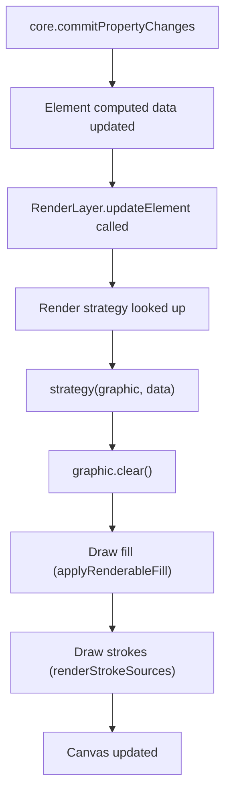

# 05 — Render Pipeline

This chapter traces the rendering path from the core framework's data update through to the final PixiJS canvas output.

## Architecture Overview



## Step-by-Step: Render Trigger

### Step 1: Element computed data is updated

After `core.commitPropertyChanges()`, the framework recalculates the element's computed data. For a rectangle element, this produces a flat data object like:

```typescript
{
  id: 'rect_0',
  type: 'rect',
  x: 100, y: 100,
  width: 200, height: 150,
  fills: [{ id: 'fill_0', kind: 'solid', color: '#ffffff', opacity: 1, ... }],
  strokes: [{ id: 'stroke_0', style: 'solid', position: 'center', width: 5, color: '#000000', ... }]
}
```

### Step 2: `RenderLayer.updateElement` is called

**File**: `packages/render/src/layers/scene/render-layer.ts` (line ~138)

```typescript
updateElement(elementId, key, before, after, data?) {
  const element = this.getElementById(elementId)
  // ...
  const strategy = data
    ? renderStrategyRegistry.get(data.type) || defaultStrategy
    : null
  if (strategy && element instanceof Graphics && data) {
    strategy(element, data)  // Full redraw
  }
}
```

**What this does**: Looks up the render strategy for the element type (e.g., `'rect'`) from the registry and invokes it with the full data object.

### Step 3: Render strategy executes

Each shape type registers its own render strategy. The strategy redraws the entire element, including fills and strokes.

**Example — Rectangle** (`packages/preset/src/components/rectangle.ts`):

```typescript
renderStrategy: (graphic, data) => {
  graphic.clear()                                    // Step 3a: Clear previous render

  const replayPath = () => {
    graphic.rect(0, 0, data.width, data.height)      // Step 3b: Define shape path
  }
  replayPath()

  applyRenderableFill(graphic, data.fills, { replayPath })  // Step 3c: Apply fills

  renderStrokeSources(                               // Step 3d: Render strokes
    graphic,
    buildRectangleStrokeSources(data.width, data.height),
    data.strokes
  )

  graphic.x = data.x                                 // Step 3e: Position element
  graphic.y = data.y
}
```

### Step 3a: `graphic.clear()`

Clears all existing drawings on the PixiJS `Graphics` object. This removes all fill paths, mesh children, and any cached stroke projections.

### Step 3b: Shape path definition

Defines the geometry of the shape. For rectangle, it's `graphic.rect(0, 0, w, h)`. This path is used for fills, not strokes.

### Step 3c: Fill application

Fills are applied first (strokes are drawn on top).

### Step 3d: `renderStrokeSources`

This is the main stroke rendering entry point and is covered in detail below.

### Step 3e: Element positioning

Sets the translation on the Graphics container.

---

## `renderStrokeSources` — Core Stroke Rendering

**File**: `packages/preset/src/components/strokes.ts` (line ~1235)

```typescript
const renderStrokeSources = (graphic, sources, strokes) => {
  const renderableStrokes = getRenderableStrokes(strokes)
  const graphicHost = graphic as StrokeOverlayHost
  clearMeshProjectionCache(graphicHost)    // Step A

  if (renderableStrokes.length === 0) return

  renderableStrokes.forEach((stroke, strokeIndex) => {      // Step B
    sources.forEach(({ geometry, sampledPoints, closed }, sourceIndex) => {
      const strokePoints = closed
        ? normalizeClosedPoints(sampledPoints)
        : [...sampledPoints]
      if (strokePoints.length < 2) return

      if (stroke.style === StrokeStyles.DASHED) {            // Step C
        const dashedGeometry = createDashedGeometryModel(geometry, stroke)
        fillStrokePolygonsWithMesh(
          graphicHost,
          dashedGeometry?.model.polygons ?? [],
          stroke,
          `dashed_${strokeIndex}_${sourceIndex}`
        )
        return
      }

      const solidPolygons = buildSolidStrokePolygons(         // Step D
        strokePoints, closed, stroke
      )
      fillStrokePolygonsWithMesh(
        graphicHost,
        solidPolygons,
        stroke,
        `solid_${strokeIndex}_${sourceIndex}`
      )
    })
  })
}
```

### Step A: Clear previous mesh cache

All existing `MeshProjection` objects are disposed and the cache map is cleared.

### Step B: Convert `StrokeAttrs[]` → `RenderableStroke[]`

`getRenderableStrokes(strokes)`:
1. Iterates the raw strokes array.
2. For each stroke, normalizes it via `normalizeStrokeEntry` (fills in defaults).
3. Calls `getRenderableStroke` to convert to render-ready format.
4. **Filters out** strokes that are `!visible` or have `width <= 0` or have an unparseable color.

### Step C: Dashed stroke path

For dashed strokes, the geometry model is generated first (see [06-geometry-model.md](./06-geometry-model.md)), producing a `GeometryModel` with pre-computed polygons. These polygons are then passed to `fillStrokePolygonsWithMesh`.

### Step D: Solid stroke path

For solid strokes, `buildSolidStrokePolygons` computes the stroke outline polygons directly (see [06-geometry-model.md](./06-geometry-model.md)). These are then passed to `fillStrokePolygonsWithMesh`.

### Step E: `fillStrokePolygonsWithMesh`

**File**: `packages/preset/src/components/strokes.ts` (line ~866)

This function creates (or updates) a `MeshProjection` to render the polygons.

```typescript
const fillStrokePolygonsWithMesh = (host, polygons, stroke, cacheKey) => {
  const drawablePolygons = polygons.filter(p => p.length >= 3)
  if (drawablePolygons.length === 0) return false
  if (typeof host.addChild !== 'function') return false

  const geometryModel = createGeometryModelFromPolygons(drawablePolygons)

  let projectionCache = cache.get(cacheKey)
  if (!projectionCache || projectionCache.color !== stroke.color || ...) {
    // Create new MeshProjection
    projectionCache?.projection.dispose()
    const projection = createMeshProjection({
      model: geometryModel,
      paint: { kind: 'solid', color: stroke.color, alpha: stroke.alpha }
    })
    projectionCache = { projection, color: stroke.color, alpha: stroke.alpha }
    cache.set(cacheKey, projectionCache)
    projection.attach(host)   // Add Mesh as child of the Graphics object
  } else {
    // Update existing MeshProjection geometry
    projectionCache.projection.update({
      model: geometryModel,
      paint: { kind: 'solid', color: stroke.color, alpha: stroke.alpha }
    })
  }

  return true
}
```

**What this does**:
1. Converts polygons into a `GeometryModel` (list of point arrays with bounds).
2. Creates or updates a `MeshProjection` (see [07-mesh-projection.md](./07-mesh-projection.md)).
3. The `MeshProjection` renders as a PixiJS `Mesh` child of the `Graphics` object.

---

## Stroke Path Sources

Before `renderStrokeSources` can work, it needs **path sources** — the geometric definition of the shape's outline that strokes should follow.

Each shape builds its own `StrokePathSource[]`:

### Rectangle / Frame

```typescript
buildPolylineStrokePathSources([{
  points: [
    { x: 0, y: 0 },
    { x: width, y: 0 },
    { x: width, y: height },
    { x: 0, y: height }
  ],
  closed: true
}])
```

Four corner points, closed polygon.

### Oval

```typescript
buildPolylineStrokePathSources([{
  points: Array.from({ length: 48 }, (_, i) => {
    const angle = (i / 48) * Math.PI * 2
    return {
      x: width/2 + Math.cos(angle) * (width/2),
      y: height/2 + Math.sin(angle) * (height/2)
    }
  }),
  closed: true
}])
```

48-point polygon approximating an ellipse.

### Vector

Uses `buildVectorGeometryModelPath`, which builds `PathGeometry` from the vector's point/segment/network data, then converts to `StrokePathSource[]` using the geometry model system.

---

## Summary: Full Render Call Stack

```
renderStrategy(graphic, data)
  └── renderStrokeSources(graphic, sources, data.strokes)
      └── getRenderableStrokes(data.strokes)
          └── getRenderableStroke(stroke)  // filter + convert
      └── for each (stroke, source):
          ├── [SOLID] buildSolidStrokePolygons(points, closed, stroke)
          │   └── offsetPolyline → buildStrokeBandPolygon → clip
          ├── [DASHED] createDashedGeometryModel(geometry, stroke)
          │   └── buildDashIntervals → sample → buildBandPolygon → merge
          └── fillStrokePolygonsWithMesh(host, polygons, stroke, key)
              └── createMeshProjection({ model, paint })
                  └── earcut triangulation → PixiJS Mesh
```
