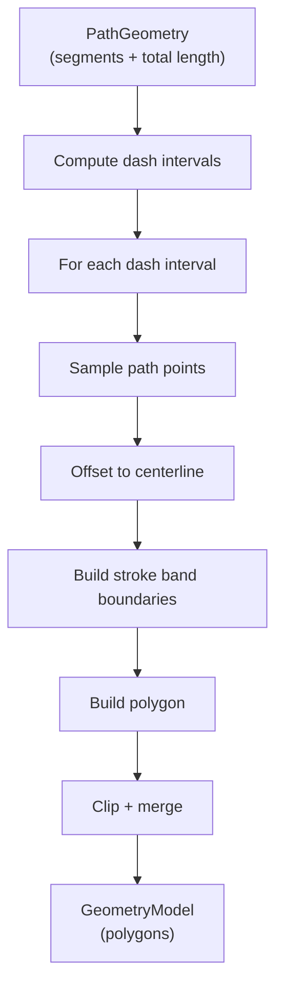

# 06 — Geometry Model

This chapter explains how stroke outlines are computed as polygons, covering both **solid** and **dashed** strokes.

## Overview

Strokes are not drawn using PixiJS's built-in `Graphics.stroke()`. Instead, they are computed as **polygonal outlines** and rendered as filled **Mesh** objects. This approach gives precise control over stroke position (center/inside/outside), join types, and dashed patterns.


---

## Part 1: Solid Stroke Polygons

**Entry point**: `buildSolidStrokePolygons` in `packages/preset/src/components/strokes.ts` (line ~1179)

### Step 1: Normalize points

```typescript
const strokePoints = closed
  ? normalizeClosedPoints(points)  // Remove duplicate closing point
  : [...points]
```

For closed shapes, if the first and last points are identical (within epsilon), the last point is removed.

### Step 2: Compute centerline offset

```typescript
const centerlineOffset = getStrokeCenterlineOffset(strokePoints, closed, stroke)
```

**What this does**:
- **Center position** or **open path**: offset = `0` (stroke is symmetric around the original path).
- **Inside position** (closed): offset = `halfWidth × orientation` (shifts centerline inward).
- **Outside position** (closed): offset = `−halfWidth × orientation` (shifts centerline outward).

The `orientation` is determined by `polygonArea(points)`: positive area = counter-clockwise, negative = clockwise. This ensures "inside" always means geometrically inside regardless of winding direction.

### Step 3: Offset the polyline to get the shifted centerline

```typescript
const renderPoints = offsetPolyline(
  strokePoints,
  centerlineOffset,
  closed,
  validateIntersection
)
```

**`offsetPolyline`** (line ~989):
1. For each consecutive pair of points, creates a **shifted segment** — the segment displaced by `signedDistance` (the offset) along its left normal.
2. For each interior vertex, finds the **intersection** of the two adjacent shifted segments.
3. Special handling for acute angles: uses intersection directly for angles < 30°.
4. Falls back to midpoint averaging when intersection is behind the shifted segments.
5. For **open** paths, endpoints use the shifted segment's start/end directly.
6. For **closed** paths, all vertices use wrapping adjacency.

### Step 4: Build stroke band boundaries

For **open paths**, `buildCenteredStrokeBandBoundaries` (line ~552):

```typescript
const leftBoundary = offsetPolyline(normalizedPoints, radius, false, false)
const rightBoundary = offsetPolyline(normalizedPoints, -radius, false, false)
```

This creates two parallel polylines — one offset left, one offset right — forming the two edges of the stroke.

Returns: `{ outerBoundary, innerBoundary, centerlinePoints }`

### Step 5: Build the polygon

For **open paths**, `buildStrokeBandPolygon` (line ~475):

```typescript
const polygon = [
  ...outerBoundary,
  ...endCap,          // Round cap at the end
  ...innerBoundary.reverse(),
  ...startCap         // Round cap at the start
]
```

The stroke outline is constructed by tracing:
1. Forward along the outer boundary.
2. Around the end cap (round arc).
3. Backward along the inner boundary.
4. Around the start cap (round arc).

For **closed paths**, `buildClosedStrokePolygons` (line ~1148):

```typescript
const outerBoundary = offsetPolyline(points, radius, true, false)
const innerBoundary = offsetPolyline(points, -radius, true, false)
const polygon = [...outerBoundary, ...innerBoundary.reverse()]
```

No caps needed — the polygon naturally closes.

### Step 6: Inside clipping (for inside-positioned strokes)

For **inside-positioned** strokes on closed paths, the polygon is clipped against each edge of the original shape using Sutherland-Hodgman-style half-plane clipping:

```typescript
if (insideOrientation !== 0) {
  return polygons
    .map(polygon => clipInsideDashPolygon(polygon, strokePoints, insideOrientation))
    .filter(polygon => polygon.length >= 3)
}
```

`clipInsideDashPolygon` iterates over each edge of the original path and clips the stroke polygon to the inside of that edge. Multiple passes (up to 3) are performed for convergence.

---

## Part 2: Dashed Stroke Geometry

**Entry point**: `createDashedGeometryModel` in `packages/preset/src/components/geometry-model.ts`

Dashed strokes are significantly more complex than solid strokes. The system uses a **sampling-based** approach.

### Overview



### Step 1: Build `PathGeometry`

`buildVectorGeometryModelPath` or `buildPolylineGeometryModelPath` creates a `PathGeometry`:

```typescript
interface PathGeometry {
  segments: PathSegment[]  // Line or cubic Bézier segments
  closed: boolean
  totalLength: number      // Sum of all segment lengths
  sampledPoints: Vec2[]    // Dense point sampling of the path
}
```

For polylines, each pair of consecutive points becomes a line segment.
For vectors, Bézier curves are preserved as `cubic` segments with the `bezier-js` library.

### Step 2: Compute dash/gap intervals

`buildDashIntervals` distributes dash and gap intervals along the path's total length:

```typescript
const { dash, gap } = getDashPattern(stroke)
// dash = max(0.1, stroke.dash)
// gap  = max(0.1, stroke.gap)
```

Intervals are computed as `[0, dash], [dash+gap, 2*dash+gap], ...` until exceeding `totalLength`. For closed paths, the last dash may wrap around.

### Step 3: Build context for each dash

`createDashedStrokeGeometryContext` computes reusable context:

```typescript
{
  dash, gap,
  halfWidth: stroke.width / 2,
  centerlineOffset,
  contextPadding: max(width, width/2 + 1),  // Extra sampling for joins
  tessellationTolerance,
  insideOrientation,
  usesInsideOneSided,
  cornerConstraints  // For inside-positioned strokes
}
```

### Step 4: Sample points for each dash segment

For each dash interval `[startDist, endDist]`:

1. **Source points**: Sample the path between `startDist` and `endDist`.
2. **Context points**: Also sample a bit before and after (the `contextPadding`) — this extra context ensures that the stroke bands join properly at the edges.
3. **Clip indices**: Track where the actual dash starts within the context points.

`samplePathInterval` handles both line segments (linear interpolation) and cubic Bézier segments (adaptive subdivision using the `bezier-js` library).

### Step 5: Offset and build boundaries

The sampled points are offset to the centerline (for inside/outside positioning), then the stroke band boundaries are computed just like solid strokes:

```typescript
const boundaries = buildCenteredStrokeBandBoundaries(
  boundarySourcePoints, stroke,
  { contextStartIndex, contextPointCount }
)
```

### Step 6: Build dash polygon

Each dash becomes one or more polygons via `buildStrokeBandPolygon`:
- Start cap: round arc (unless touching a corner constraint).
- End cap: round arc (unless touching a corner constraint).
- Outer/inner boundaries traced as a closed polygon.

### Step 7: Corner constraints (inside-positioned dashed strokes)

For inside-positioned dashed strokes, **corner constraints** prevent stroke caps from protruding past shape corners. The system:

1. Identifies path corners via `buildPathCornerConstraints`.
2. For each dash near a corner, clips the stroke polygon using **wedge clipping** — cutting the polygon along two half-planes defined by the corner's adjacent edge directions.
3. Snaps dash endpoints to corner positions when they fall near a corner boundary.

### Step 8: Merge overlapping polygons

For center/outside positioned dashed strokes, neighboring dash polygons that overlap are merged using `mergeOverlappingConvexPolygons`:
- Uses convex hull to combine overlapping polygons.
- Removes degenerate (zero-area) results.

### Step 9: Return `DashedGeometryModelResult`

```typescript
interface DashedGeometryModelResult {
  model: GeometryModel       // Final polygons for rendering
  hitPolygons: Vec2[][]       // Polygons for hit testing
  debugParts: GeometryModelDebugPart[]  // Debug info per dash
}
```

---

## Round Caps

**All strokes use round caps** (hardcoded: `cap: 'round'`).

The round cap is generated by `buildStrokeCapArcPoints`:
1. Center point: the path endpoint on the centerline.
2. Start/end points: the boundary points at the path endpoint.
3. Arc: computed via angular stepping with adaptive step size based on radius.
4. Direction: `chooseStrokeCapArcClockwise` picks CW or CCW based on which direction faces outward.

The step angle is computed to keep the sagitta (arc deviation from chord) below `0.25px`:
```typescript
const step = 2 * Math.acos(1 - 0.25 / radius)
```
