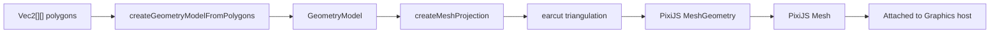

# 07 — Mesh Projection

This chapter explains how computed stroke polygons are turned into renderable PixiJS `Mesh` objects on the canvas.

## Overview



## Why Mesh Instead of Graphics.stroke()?

PixiJS's built-in `Graphics.stroke()` uses its own stroke offset algorithm which does not support:
- Inside/outside stroke positioning
- Precise miter limit control
- Custom dash patterns with corner-aware clipping

By computing the stroke as polygons and rendering them as filled meshes, Asyra gains full control over every aspect of stroke rendering.

## Step-by-Step

### Step 1: Convert polygons to GeometryModel

**File**: `packages/preset/src/components/strokes.ts` (line ~829)

```typescript
const createGeometryModelFromPolygons = (polygons: Vec2[][]): GeometryModel => {
  // Convert Vec2[] to GeometryPoint[] format
  const geometryPolygons = polygons.map(polygon =>
    polygon.map(point => ({ x: point.x, y: point.y }))
  )

  // Calculate bounds
  let minX = Infinity, minY = Infinity, maxX = -Infinity, maxY = -Infinity
  geometryPolygons.forEach(polygon =>
    polygon.forEach(point => {
      minX = Math.min(minX, point.x)
      minY = Math.min(minY, point.y)
      maxX = Math.max(maxX, point.x)
      maxY = Math.max(maxY, point.y)
    })
  )

  return { polygons: geometryPolygons, bounds: { minX, minY, maxX, maxY } }
}
```

The `GeometryModel` interface:

```typescript
interface GeometryModel {
  polygons: GeometryPoint[][]   // List of polygons
  bounds?: {
    minX: number; minY: number;
    maxX: number; maxY: number;
  }
}
```

### Step 2: Create MeshProjection

**File**: `packages/render/src/projections/mesh-projection.ts` (line ~160)

```typescript
const createMeshProjection = (options) => {
  const initialGeometry = createGeometry(options.model)
  const root = new Container()
  const mesh = new Mesh({
    geometry: initialGeometry ?? emptyGeometry,
    texture: Texture.WHITE
  })
  root.addChild(mesh)

  // Apply paint (color + alpha)
  mesh.tint = options.paint.color   // Integer color (0xRRGGBB)
  mesh.alpha = options.paint.alpha  // 0–1
  
  return { attach, update, setVisible, dispose }
}
```

### Step 3: Triangulation via `earcut`

**File**: `packages/render/src/projections/mesh-projection.ts` (line ~88)

Each polygon is triangulated using the `earcut` algorithm:

```typescript
const triangulatePolygon = (polygon, vertexOffset, vertices, indices) => {
  if (polygon.length < 3) return

  // Flatten to [x0, y0, x1, y1, ...]
  const flatPolygon = []
  polygon.forEach(point => flatPolygon.push(point.x, point.y))

  // Triangulate
  const polygonIndices = earcut(flatPolygon)

  // Append to buffers
  vertices.push(...flatPolygon)
  polygonIndices.forEach(index => indices.push(vertexOffset + index))
}
```

**earcut** is a fast polygon triangulation library that handles simple polygons, including non-convex ones. It produces triangle indices into the flat vertex array.

### Step 4: Build MeshGeometry

```typescript
const createGeometry = (model) => {
  const meshData = buildProjectionMeshData(model)
  if (!meshData) return null

  return new MeshGeometry({
    positions: meshData.vertices,   // Float32Array [x0,y0,x1,y1,...]
    indices: meshData.indices,      // Uint32Array [i0,i1,i2,...]
    uvs: meshData.uvs              // Float32Array [u0,v0,u1,v1,...]
  })
}
```

UV coordinates are computed from the bounds:
```typescript
uvs[i]   = (vertices[i] - bounds.minX) / width
uvs[i+1] = (vertices[i+1] - bounds.minY) / height
```

UVs are normalized to [0,1] based on the bounding box. Since stroke meshes use `Texture.WHITE` and solid tint colors, UVs are effectively unused for visual output but are required by the PixiJS `Mesh` API.

### Step 5: Attach to host Graphics

```typescript
attach: (host) => {
  if (!(host instanceof Container)) return false
  if (root.parent !== host) {
    host.addChild(root)   // Add the mesh container as a child
  }
  return true
}
```

The `MeshProjection`'s root `Container` (containing the `Mesh`) is added as a child of the element's `Graphics` object. This means:
- The stroke mesh inherits the element's transforms (position, rotation, scale).
- Multiple stroke meshes (one per stroke per path source) coexist as children.

### Step 6: Update (when stroke properties change)

```typescript
update: (next) => {
  const nextGeometry = createGeometry(next.model)
  if (!nextGeometry) { root.visible = false; return }

  const previousGeometry = mesh.geometry
  mesh.geometry = nextGeometry
  root.visible = true
  mesh.tint = next.paint.color
  mesh.alpha = next.paint.alpha
  previousGeometry.destroy()  // Free GPU resources
}
```

### Step 7: Dispose (when element is removed or strokes are cleared)

```typescript
dispose: () => {
  if (root.parent) root.parent.removeChild(root)
  root.destroy({ texture: false, textureSource: false })
}
```

Removes the mesh from the scene graph and frees GPU resources (but keeps the shared white texture).

---

## Caching Strategy

**File**: `packages/preset/src/components/strokes.ts` (line ~56)

Each `Graphics` host maintains a `MeshProjection` cache:

```typescript
interface StrokeOverlayHost extends StrokeDrawGraphic {
  __asyraMeshProjectionCache?: Map<string, MeshProjectionCache>
}

interface MeshProjectionCache {
  projection: MeshProjection
  color: number
  alpha: number
}
```

- Cache key format: `"solid_0_0"` or `"dashed_1_0"` (style + strokeIndex + sourceIndex).
- On each render cycle, `clearMeshProjectionCache` disposes ALL cached projections, then new ones are created/updated. This ensures correctness when strokes are added/removed/reordered.

---

## Paint Model

Currently only solid paint is supported:

```typescript
interface MeshProjectionPaintSolid {
  kind: 'solid'
  color: number   // Integer color (e.g., 0xFF0000 for red)
  alpha: number   // 0–1
}
```

The color integer is computed from the stroke's hex color via `rgbaToColorInt(parseColor(stroke.color))`, and alpha is `clampOpacity(parsedColor.a * stroke.opacity)`.
