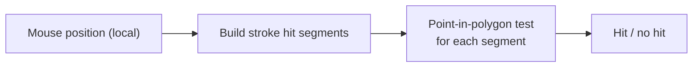

# 08 — Hit Testing

This chapter explains how the system determines whether a mouse click or hover lands on a stroke.

## Overview

Hit testing for strokes uses the same polygon-based approach as rendering. The stroke outlines are computed as polygons, and point-in-polygon tests determine if a coordinate hits a stroke.



## Key Functions

### `getStrokeHitWidth`

**File**: `packages/preset/src/components/strokes.ts` (line ~167)

```typescript
const getStrokeHitWidth = (strokes: unknown): number => {
  const renderableStrokes = getRenderableStrokes(strokes)
  return renderableStrokes.reduce(
    (maxWidth, stroke) => Math.max(maxWidth, stroke.width), 0
  )
}
```

Returns the maximum stroke width across all visible strokes. This is used to expand the bounding box for initial coarse-phase hit detection.

### `buildStrokeHitSegments`

**File**: `packages/preset/src/components/strokes.ts` (line ~1075)

```typescript
const buildStrokeHitSegments = (polylines, strokes): StrokeHitSegment[] =>
  buildStrokeHitSegmentsFromSources(
    buildPolylineStrokePathSources(polylines),
    strokes
  )
```

Converts polylines to path sources, then builds hit segments.

### `buildStrokeHitSegmentsFromSources`

**File**: `packages/preset/src/components/strokes.ts` (line ~1084)

```typescript
const buildStrokeHitSegmentsFromSources = (sources, strokes) => {
  const renderableStrokes = getRenderableStrokes(strokes)
  if (renderableStrokes.length === 0) return []

  const hitSegments: StrokeHitSegment[] = []

  renderableStrokes.forEach((stroke) => {
    if (stroke.width <= 0) return

    sources.forEach(({ geometry, sampledPoints, closed }) => {
      const strokePoints = closed
        ? normalizeClosedPoints(sampledPoints)
        : [...sampledPoints]
      if (strokePoints.length < 2) return

      if (stroke.style === StrokeStyles.DASHED) {
        // For dashed strokes: use the geometry model's hit polygons
        const dashedGeometry = createDashedGeometryModel(geometry, stroke)
        dashedGeometry?.hitPolygons.forEach((polygon) => {
          if (polygon.length >= 3)
            hitSegments.push({ kind: 'polygon', points: polygon })
        })
        return
      }

      // For solid strokes: build the outline polygons
      const polygons = buildSolidStrokePolygons(strokePoints, closed, stroke)
      polygons.forEach((polygon) => {
        if (polygon.length >= 3)
          hitSegments.push({ kind: 'polygon', points: polygon })
      })
    })
  })

  return hitSegments
}
```

**What this does**:
1. Converts strokes to renderable format (filters invisible/zero-width).
2. For each stroke × path source combination:
   - **Solid**: computes the same outline polygons used for rendering.
   - **Dashed**: computes the geometry model and extracts `hitPolygons` (same geometry as render, kept separately for hit testing).
3. Each polygon becomes a `StrokeHitSegment`.

### `StrokeHitSegment` Interface

```typescript
interface StrokeHitSegment {
  kind: 'polygon'
  points: Vec2[]
}
```

Each hit segment is a closed polygon. Hit testing checks if the query point lies inside any of these polygons.

---

## Hit Testing in Vector Elements

**File**: `packages/preset/src/components/vector.ts` (line ~779)

For vectors, stroke hit testing is integrated into the custom hit area:

```typescript
const isPointNearStrokeHitSegments = (point, segments) =>
  segments.some((segment) => {
    if (segment.kind === 'polygon') {
      const polygon = segment.points ?? []
      if (polygon.length < 3) return false

      // Standard ray-casting point-in-polygon test
      let inside = false
      for (let i = 0, j = polygon.length - 1; i < polygon.length; j = i++) {
        const pi = polygon[i]
        const pj = polygon[j]
        const intersects =
          (pi.y > point.y) !== (pj.y > point.y) &&
          point.x < ((pj.x - pi.x) * (point.y - pi.y)) / (pj.y - pi.y) + pi.x
        if (intersects) inside = !inside
      }
      return inside
    }
  })
```

This uses the standard **ray-casting algorithm** — casts a horizontal ray from the test point and counts how many polygon edges it crosses. An odd count means the point is inside.

### Vector hit area composition

The vector's hit area combines fill and stroke hit tests:

```typescript
hitArea: {
  contains: (x, y) => {
    // Check fill first (even-odd rule)
    if (hasVisibleFill && isPointInsidePreparedEvenOddShape(point, fillSegments))
      return true

    // Check strokes
    if (isPointNearStrokeHitSegments(point, strokeHitSegments))
      return true

    return false
  }
}
```

---

## Caching

The vector component caches stroke hit segments in `VectorHitCache`:

```typescript
interface VectorHitCache {
  strokeHitSegments?: StrokeHitSegment[]
  strokeHitSignature?: string   // Change detection key
  // ...
}
```

The `strokeHitSignature` is a composite string that changes when the relevant data changes, allowing the system to skip expensive polygon recomputation when nothing affecting strokes has changed.

---

## Performance Considerations

- Hit testing reuses the same polygon computation as rendering. This is intentional — the hit area should exactly match what the user sees.
- For dashed strokes, the geometry model provides separate `hitPolygons` in its result. These are the same as the render polygons before mesh triangulation.
- The ray-casting algorithm has O(n) complexity per polygon edge, but since stroke polygons are typically small (10–100 vertices), this is fast enough.
