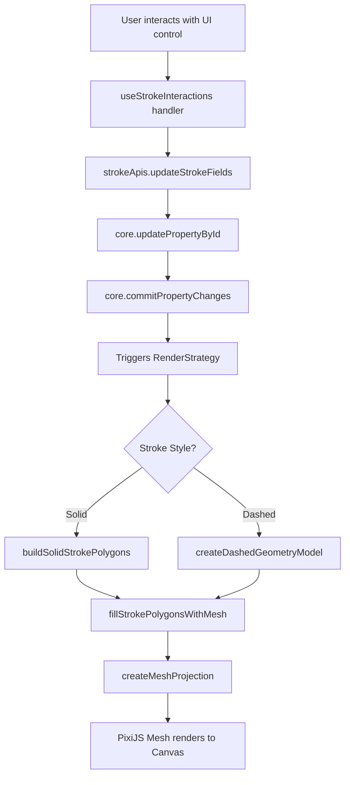

# Strokes Manual

## Overview

This manual documents the complete Strokes system in Asyra Design. It covers every user-facing setting available in the UI, and traces the step-by-step execution flow that occurs after each setting is modified — spanning the UI layer, data layer, logic layer, geometry computation layer, mesh layer, and rendering layer.

## Manual Structure

The manual is split into chapters following the system's layered architecture:

| File | Content |
|------|---------|
| [01-ui-settings.md](./01-ui-settings.md) | All user-configurable stroke settings in the UI |
| [02-data-model.md](./02-data-model.md) | Stroke data model and type definitions |
| [03-ui-to-api-flow.md](./03-ui-to-api-flow.md) | UI interaction → API call flow |
| [04-api-to-core-flow.md](./04-api-to-core-flow.md) | API → Core property write flow |
| [05-render-pipeline.md](./05-render-pipeline.md) | Core → rendering pipeline |
| [06-geometry-model.md](./06-geometry-model.md) | Geometry computation (solid/dashed stroke polygon construction) |
| [07-mesh-projection.md](./07-mesh-projection.md) | Mesh triangulation and PixiJS projection |
| [08-hit-testing.md](./08-hit-testing.md) | Stroke hit testing |
| [09-per-shape-integration.md](./09-per-shape-integration.md) | How each shape component integrates strokes |

## Quick Reference: Core File Index

```
apps/asyra-design/
├── src/properties/strokes/        # UI components (React)
│   ├── index.tsx                  # Strokes section entry point
│   ├── list.tsx                   # Stroke list (add/remove)
│   ├── stroke.tsx                 # All controls for a single stroke
│   ├── stroke-color-row.tsx       # Color + opacity row
│   ├── stroke-color-controls.tsx  # ColorPicker wrapper
│   └── use-stroke-interactions.ts # All handler logic
├── src/common-apis/strokes.ts     # Stroke API (writes to Core)
├── src/constants/strokes.ts       # Writable field list
├── src/controllers/scene-tree.ts  # Batch setting update controller
└── src/providers/properties.ts    # useStrokes / useStroke hooks

packages/utils/src/propsManager/
├── strokes.ts                     # StrokeAttrs type + defaults
└── enum.ts                        # PropertyTypes (STROKE / STROKES)

packages/preset/src/
├── props/components/strokes-component.ts  # Property Component definition
├── components/strokes.ts                  # Core rendering logic (1287 lines)
├── components/geometry-model.ts           # Dashed stroke geometry model (2720 lines)
├── components/rectangle.ts                # Rectangle stroke integration
├── components/oval.ts                     # Oval stroke integration
├── components/frame.ts                    # Frame stroke integration
├── components/vector.ts                   # Vector stroke integration
└── ui/register-properties.ts              # UI Property registration

packages/render/src/projections/
└── mesh-projection.ts             # MeshProjection (triangulation + PixiJS Mesh)
```

## System Architecture Diagram


