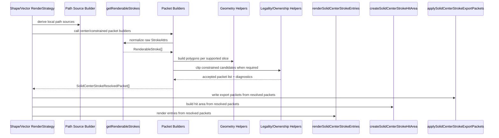

# Professional Stroke Engine Algorithm Flow

This document is the canonical flow contract for the current Asyra Design
stroke engine rollout.

It exists to prevent ad-hoc fixes. Before changing stroke geometry, packet
routing, visual contracts, hit testing, or export packets, read this file and
update the relevant flow section first.

Companion documents:

- `docs/ai/apps/asyra-design/plans/professional-stroke-engine-plan.md`
- `docs/ai/apps/asyra-design/plans/professional-stroke-engine-execution-plan.md`
- `docs/ai/apps/asyra-design/rules/scenario-matrix-testing.md`

## Scope

Current execution scope:

- uniform-width stroke geometry
- `center` / `inside` / `outside`
- `solid` / `dashed`
- `miter` / `bevel` / `round` joins
- `butt` / `square` / `round` caps
- render / hit-test / export parity from the same resolved packets

Out of current execution scope:

- variable width
- gradient algorithm expansion
- paint sampling policy
- self-intersecting constrained semantics unless explicitly promoted
- multi-network constrained ownership unless explicitly promoted

## Pre-Implementation Rule

Any stroke engine change must start from the flow, not from a screenshot.

Required order:

1. Identify the scenario family and owner stage.
2. Update this flow document if the helper/API sequence changes.
3. Add or update unit contracts for the algorithm output.
4. Add or update visual contracts for the app-path output.
5. Implement the smallest runtime change.
6. Rebuild `@asyra/preset` if app-path behavior depends on preset dist.

Expansion self-review before broadening a slice:

1. Which later phase is blocked if this case is deferred?
2. Would this change an externally exposed interface?
3. Is the added work more than `20%` of the current phase scope?

If no later phase is blocked, put the case in backlog and continue downstream.
If the interface changes, stop for approval. If the added work is more than
`20%`, stop for approval.

## Runtime Sequence

The invariant is that render, hit-test, and export all consume the same
`SolidCenterStrokeResolvedPacket[]`.

## Shared Data Contracts

### Raw Input

Source:

- `packages/utils/src/propsManager/strokes.ts`

Shape:

- `StrokeAttrs[] | undefined`

Important fields:

- `visible`
- `style`
- `position`
- `width`
- `dashPattern`
- `dashOffset`
- `joinType`
- `capType`
- `miterAngle`
- paint fields

### Normalized Stroke

Helper:

- `packages/preset/src/components/stroke-render/renderable-stroke.ts`
- `getRenderableStrokes(strokes)`

Input:

- raw `StrokeAttrs[] | undefined`

Output:

- `RenderableStroke[]`

Responsibilities:

- fill missing defaults through `createDefaultStroke`
- drop invisible or zero-width strokes
- parse color and opacity
- normalize dash pattern and dash offset
- normalize join/cap/miter semantics
- prepare paint payload fields

Non-responsibilities:

- no geometry construction
- no inside/outside legality
- no dash interval slicing
- no render/hit/export side effects

## Path Source Stage

### Rectangle

File:

- `packages/preset/src/components/rectangle.ts`

Path source:

- four local points:
  - `(0, 0)`
  - `(width, 0)`
  - `(width, height)`
  - `(0, height)`
- `closed: true`

Current packet calls:

- `buildSolidCenterStrokeResolvedPackets`
- `buildDashedCenterStrokeResolvedPackets`
- `buildConstrainedDashedStrokeResolvedPackets`
- `buildConstrainedSolidStrokeResolvedPackets`
- `buildConstrainedSolidLegalityClippingResult`

Rectangle-specific constraints:

- may opt into rectangle-only constrained dashed promotion flags
- must not use rectangle promotion flags as proof for generic vector behavior

### Oval

File:

- `packages/preset/src/components/oval.ts`

Path source:

- sampled ellipse loop from `buildEllipseLoop(width, height)`
- `closed: true`

Current packet calls:

- same packet families as rectangle

Oval-specific constraints:

- sampled path is not rectangle-equivalent
- constrained dashed promotion must be explicitly recorded before treating an
  oval slice as supported

### Vector

File:

- `packages/preset/src/components/vector.ts`

Path source:

- stable network order
- `buildVectorGeometryModelPath(network, points, segments)`
- output includes:
  - `sampledPoints`
  - `closed`
  - `totalLength`

Current packet calls:

- `buildSolidCenterStrokeResolvedPackets`
- `buildDashedCenterStrokeResolvedPackets`
- `buildConstrainedDashedStrokeResolvedPackets`
- `buildConstrainedSolidStrokeResolvedPackets`
- `buildConstrainedSolidLegalityClippingResult`

Vector-specific constraints:

- open vectors may fall back to center rendering for authored constrained
  position, but that is visibility fallback, not exact constrained geometry
- constrained dashed packets are accepted only when packet ownership is bounded
  to one network/stroke owner
- rectangle-equivalent vector cases are semantic gates, not separate engine
  architectures
- non-rectangle-equivalent vector cases require their own scenario-family
  promotion

## Packet Families

### Solid Center

Entry helper:

- `buildSolidCenterStrokeResolvedPackets(cachePrefix, points, closed, strokes)`

Support gate:

- `supportsSolidCenterStroke(stroke)`

Geometry helper:

- `buildSolidCenterStrokePolygons(points, closed, stroke)`

Input:

- local path points
- `closed`
- raw strokes

Output:

- one `SolidCenterStrokeResolvedPacket` per supported stroke

Supported current baseline:

- `style: solid`
- `position: center`
- `width > 0`
- joins: `miter`, `bevel`, `round`
- caps: `butt`, `square`, `round`

Restrictions:

- no constrained legality
- no dash interval allocation
- no variable width

### Dashed Center

Entry helper:

- `buildDashedCenterStrokeResolvedPackets(cachePrefix, points, closed, strokes)`

Support gate:

- `supportsDashedCenterStroke(stroke)`

Interval helper:

- `allocateDashedCenterStrokeIntervals(totalLength, dashPattern, dashOffset, closed)`

Frame slicing helper:

- `sliceDashedCenterStrokeFrames(frames, closed, startDistance, endDistance, wrapsSeam)`

Per-interval geometry helper:

- `buildSolidCenterStrokePolygons(intervalPoints, coversFullClosedLoop, solidStrokeLike)`

Input:

- local path points
- `closed`
- raw strokes

Output:

- one `SolidCenterStrokeResolvedPacket` per visible dash interval

Supported current baseline:

- `style: dashed`
- `position: center`
- `width > 0`
- non-empty normalized dash pattern
- joins: `miter`, `bevel`, `round`
- caps: `butt`, `square`, `round`

Restrictions:

- no inside/outside clipping in this family
- constrained placement must not be faked by center packets unless the vector
  fallback rule explicitly applies

### Constrained Solid

Entry helper:

- `buildConstrainedSolidStrokeResolvedPackets(cachePrefix, points, closed, strokes)`

Support gate:

- `supportsConstrainedSolidStroke(stroke, closed)`

Geometry helper:

- `buildConstrainedSolidStrokePolygons(points, closed, stroke)`

Clipping/diagnostic helper:

- `buildConstrainedSolidLegalityClippingResult(sources, strokes, candidatePackets)`

Input:

- closed local path points
- raw strokes
- candidate constrained packets

Output:

- accepted constrained packets
- legality diagnostics
- ownership diagnostics

Supported current baseline:

- `style: solid`
- `position: inside | outside`
- closed simple path
- joins: `miter`, `bevel`
- caps: `butt`, `square`

Restrictions:

- open paths are rejected as constrained geometry
- self-intersecting constrained semantics are rejected unless a scenario family
  promotes them
- constrained round geometry is Phase 5+ work and must be promoted through the
  constrained matrices, not assumed from center support

### Constrained Dashed

Entry helper:

- `buildConstrainedDashedStrokeResolvedPackets(cachePrefix, points, closed, strokes, options)`

Support gate:

- `supportsConstrainedDashedStroke(stroke, closed)`

Interval helper:

- `allocateDashedCenterStrokeIntervals(totalLength, dashPattern, dashOffset, closed)`

Topology classifiers:

- `isFullLoopVisibleInterval`
- `isSingleEdgeVisibleInterval`
- `isSingleCornerSpanningVisibleInterval`
- `isOrthogonalRectLoop`
- `isSingleObliqueQuadrilateralLoop`

Geometry helpers:

- full-loop interval:
  - `buildConstrainedSolidStrokePolygons`
- partial interval:
  - `sliceDashedCenterStrokeFrames`
  - `buildSolidCenterStrokePolygons`
  - `buildRoundCapSingleSegmentPolygons` for promoted single-edge round-cap
    cases
  - `buildConstrainedSolidLegalityClippingResult`

Input:

- closed local path points
- raw strokes
- explicit promotion options from the owning shape/vector strategy

Output:

- accepted constrained dashed packets
- packet debug metadata

Restrictions:

- promotion flags are temporary bounded execution gates, not the final
  architecture
- a promotion flag must correspond to a scenario-family contract
- multiple packet owners are rejected at the vector app path until ownership is
  explicitly promoted
- open constrained dashed paths remain visibility fallback only unless exact
  constrained open semantics are promoted

## Shared Packet Output

All packet families must return `SolidCenterStrokeResolvedPacket[]`.

Geometry packet:

- `geometryId`
- `polygons`
- `bounds`
- optional `debugMeta`

Paint packet:

- `geometryId`
- `kind`
- `color`
- `alpha`
- optional `gradientStyle`
- optional `paintKey`

Rules:

- geometry owns polygons and bounds
- paint fields are payload only; geometry must not sample or compute gradient
  colors
- packet IDs must remain stable enough for diagnostics and cache behavior

## Render / Hit / Export Stage

Export helper:

- `applySolidCenterStrokeExportPackets(graphic, packets)`

Hit helper:

- `createSolidCenterStrokeHitArea(packets)`

Render conversion:

- `toSolidCenterStrokeRenderEntries(packets)`

Render helper:

- `renderSolidCenterStrokeEntries(graphic, entries)`

Input:

- final accepted `SolidCenterStrokeResolvedPacket[]`

Output:

- export packets on the runtime graphic
- hit area using the same polygons
- Pixi mesh or gradient graphics entries

Rules:

- render/hit/export must not rebuild independent geometry
- if a packet is not in the final accepted list, it must not render, hit, or
  export
- render may cache projections, but cache invalidation must depend on geometry
  signature and paint key, not hidden state

## Diagnostics Stage

Center dashed overlap diagnostics:

- `applyCenterDashedOverlapDiagnostics`

Constrained legality diagnostics:

- `setConstrainedSolidLegalityDiagnostics`

Constrained ownership diagnostics:

- `setConstrainedSolidOwnershipDiagnostics`

Rules:

- diagnostics observe the same packet/legality path as runtime
- diagnostics cannot promote unsupported geometry
- debug-only state must be removed or documented before closeout

## Manual Review Checklist

Before declaring a stroke slice complete, verify:

- scenario family is declared
- helper/API sequence is listed in this document or unchanged by the slice
- unit tests cover packet/geometry semantics
- visual tests cover app-path behavior
- render/hit/export consume the same packet family
- `@asyra/preset` dist is rebuilt if app-path consumes preset runtime
- unsupported cases are explicitly listed as blocked/backlog

## Known Flow Debt

These are structural debts, not hidden completion claims:

- constrained dashed promotion flags should eventually be replaced by a general
  owner/domain classifier once the matrix proves enough families
- open constrained vector strokes currently use center visibility fallback, not
  exact inside/outside geometry
- self-intersecting and multi-network constrained semantics need explicit
  product semantics before implementation
- deleted legacy stroke manuals and pre-rollout stroke plans must not override
  this canonical flow document during the professional stroke engine rollout
