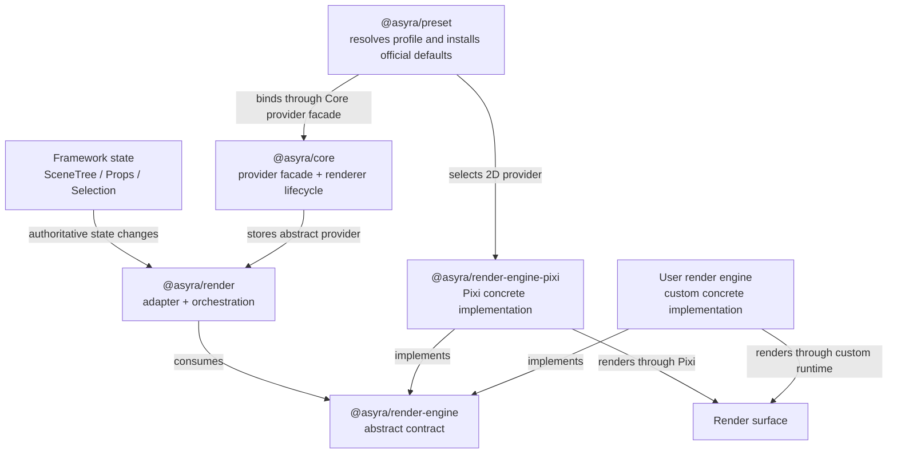

# Architecture (Framework-First)

Asyra architecture is designed around deterministic execution over declarative information models.

## Layer Model

1. Framework Core Layer

- `@asyra/core`
- orchestration, lifecycle, registrations, persistence hooks

2. Domain Runtime Layer

- `@asyra/scene-tree`
- `@asyra/props-manager`
- `@asyra/system-context`
- `@asyra/selection`

3. Interaction and Input Layer

- `@asyra/feature-system`
- `@asyra/input-system`
- `@asyra/reactive-events`

4. Output Layer

- `@asyra/render`
- `@asyra/render-engine`
- `@asyra/render-engine-pixi`
- `@asyra/ui-context` (optional convenience)

5. Transaction, Shared-Change, and Persistence Infrastructure

- `@asyra/factory`
- `@asyra/persistence`

6. Shared Infrastructure

- `@asyra/utils`

## Render Package Architecture



Dependency direction is strict:

- `@asyra/render` depends on `@asyra/render-engine`, never on a concrete engine;
- `@asyra/render-engine-pixi` depends on `@asyra/render-engine`, never on
  `@asyra/render`;
- `@asyra/preset` installs the selected official default dependency closure and
  binds the preset-owned Pixi provider only for profile `2D`; custom providers
  bind through Core when profile is `CUSTOM`;
- Core owns the default `RenderAdapter`, provider facade, exact headless
  normalization, startup, and renderer teardown;
- Render, Core, and apps remain concrete-engine-neutral.

## Canonical Intent Flow

1. An intent arrives from a human, machine, UI action, automation, AI, device,
   or external command source.
2. Feature-system executes the matching bounded behavior/session.
3. Feature calls app/common APIs or the core facade.
4. APIs update authoritative framework state inside a transaction boundary.
5. State owners enforce package-local invariants and record changes.
6. Render/UI and other projections react to the resulting state.

Canonical shorthand:

`Any Input / UI Action / Command -> Feature -> API -> State -> Render/UI`

The transaction is the mutation boundary between API orchestration and state
owners; it is not a separate source of product intent.

## Canonical State-Application Flow

Load, undo/redo replay, and future remote collaboration updates are not new
product intents and do not create parallel feature decisions.

1. Persisted, replayed, or remote state/change input arrives.
2. The owning pipeline performs migration, validation, conflict policy, or
   origin checks as applicable.
3. Apply APIs update the authoritative state owner.
4. Render/UI and other projections recompute from authoritative state.

Canonical shorthand:

`Load / Replay / Remote Update -> Validate / Resolve -> Apply API -> State Owner -> Projections`

## Architecture Invariants

- Single runtime owner for user-action execution/session/cancel: `feature-system`.
- State ownership stays split by package boundaries (scene-tree, props-manager, system-context, selection).
- Render and UI are downstream consumers of state.
- State replay/synchronization must not create a second product-decision runtime.

## Ownership Rules

- Feature-system owns execute/session/cancel runtime decisions.
- Reactive-events owns public transaction depth and the nested rollback-only
  latch; Factory owns the ordered reversible journal, validation, finalization,
  undo/redo history, and local shared-channel settlement.
- Feature-system owns cancel/error/timeout outcome decisions and serializes
  interaction operations.
- Core observes only its injected Factory instance, serializes persistence after
  committed action/undo/redo outcomes, and reports persistence separately from
  runtime commit.
- Scene-tree owns entity graph.
- Props-manager owns property component values and schema validation.
- System-context owns app/system mode flags.
- Render owns state-to-engine adaptation, layer/strategy orchestration, handle
  mapping, and normalized interaction bridging.
- Render-engine owns engine-neutral lifecycle, commands, queries, handles,
  resources, capabilities, events, errors, and contract-test types.
- Render-engine-pixi owns Pixi runtime objects, SDK calls, surface execution,
  event normalization, and concrete resource cleanup.
- UI-context owns derived UI state only.

## Instance Composition

- Each package may expose a default module-level instance for the common shared
  runtime path.
- Exported classes allow consumers to create additional instances only for the
  subsystems they need to isolate.
- Consumers are not required to create an all-package runtime container when
  only one or a few package instances need separate ownership.
- Default imports intentionally share their registered state and subscriptions.
- Custom instances must use dependencies and subscription wiring bound to those
  intended instances; importing a class does not imply that default singleton
  wiring is automatically isolated.
- Each `Render` instance owns exactly the engine instance selected directly or
  created by its injected provider; custom instances never fall back to the
  module-level Pixi composition.
- Reactive transaction depth and rollback-only state are keyed by the resolved
  TransactionOwner, so a consumer-owned Factory replay remains independent from
  an active default-runtime boundary.
- A future runtime factory may be offered as optional composition convenience,
  but it is not the required ownership model.

## Registration Surfaces

- Component registration (`defineComponent` / core path).
- Property definition registration.
- Property schema registration.
- Feature registration.
- Render layer registration through core entrypoint.

### Startup registration composition

The normal app route is:

```text
applyPreset(core, { profile?, defaults? })
-> strict profile/default resolution
-> selected official defaults in catalog order
-> profile-owned provider when profile is 2D
-> frozen preset apply result
-> remove old relation(s)
-> define new relation(s) or registrations
-> optionally unregister a complete capability
-> optionally bind an app provider when profile is CUSTOM
-> register app migration
-> core.start()
```

- Core owns one `RegistrationGraph` and the permanent composition lock.
- Preset owns deterministic pre-start composition and rollback coordination,
  but does not execute app customization or declare Core ready.
- Profile selects engine policy only; defaults select official modules only.
- Core owns an engine-neutral `RenderAdapter` by default. An exact missing
  provider becomes headless only in Core startup; direct Render and real engine
  failures remain strict.
- Package registries remain definition source-of-truth; the graph stores only
  stable `{ kind, key }` identities, owner metadata, declared relations, and
  package-local cleanup handlers.
- Component property slots and config-mode property children create structural
  `detach` relations. Feature, render strategy, UI property, and constructor-mode
  dependencies are opaque and must be declared on their local definition.
- `remove` deletes one relation and preserves both nodes. `unregister` deletes a
  capability and invokes only the owners selected by `detach` or
  `unregister-source` policy.
- There is no semantic-equivalence or replace operation. A full implementation
  change is `unregister default -> define custom`; a non-equivalent structural
  change is `remove old relation -> define new relation`.
- A bounded pre-start declarative property-type redefinition API is planned in
  `plans/property-type-redefinition-plan.md`. It will atomically rebuild one
  config-mode schema/runtime definition without inferring semantic equivalence
  or adding a general registry replace operation. Until implemented, the
  current unregister-then-define contract remains authoritative.
- The first `core.start()` closes composition permanently before renderer side
  effects and validates declared relations. Registration composition is not a
  runtime mutation or migration mechanism.

## Persistence and Loading

- Core orchestrates save/load and load hooks.
- App-level migrations run before package-level validation.
- Package validators apply fallback/reject semantics.
- Optional diagnostics can be emitted after validation without blocking load.
- Committed action, undo, and redo outcomes capture their persistence snapshot
  at commit time, deeply detach it from live mutable references, then enter a
  serial provider-I/O queue.
- Persistence failure is reported but does not reverse already committed
  runtime state; no automatic retry policy is provided.

## Local Transaction ACID Boundary

- Atomicity: rollbackable journal entries reverse in last-in-first-out order on
  explicit rollback cancellation, handler failure, timeout, or validation
  failure. User-driven interruption defaults to commit-current and finalizes
  one undoable action before the next queued interaction. Journal snapshots
  preserve declared `DataTypes`, and nested replay restoration records only
  confirmed semantic mutations, not successful no-ops.
- Consistency: synchronous validators registered on the owning Factory run in
  registration order before a non-empty commit.
- Isolation: Feature operations are serialized by the interaction queue;
  preview state may remain visible before the outer transaction closes.
- Durability: `committed` means accepted runtime state, while `persisted` means
  the configured provider acknowledged storage.
- These guarantees are local application semantics. They do not lock external
  processes or remote clients and do not provide database serializability.
- Yjs provider/room/auth, awareness/presence, remote origin and deduplication,
  reconnect, convergence, and collaborative conflict policy remain deferred.

## Package Deep Dives

See:

- `packages/core.md`
- `packages/factory.md`
- `packages/scene-tree.md`
- `packages/system-context.md`
- `packages/preset.md`
- `packages/selection.md`
- `packages/input-system.md`
- `packages/reactive-events.md`
- `packages/utils.md`
- `packages/props-manager.md`
- `packages/ui-context.md`
- `packages/render.md`
- `packages/render-engine.md`
- `packages/render-engine-pixi.md`
- `packages/feature-system.md`
