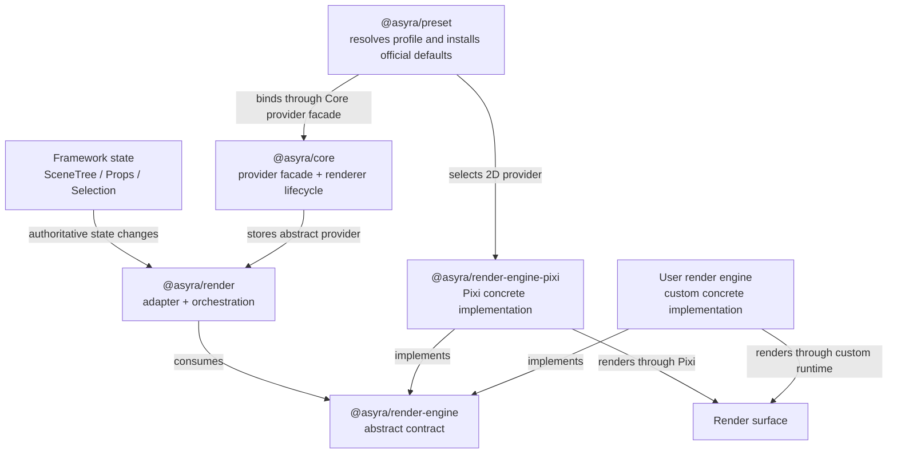

# Architecture (Framework-First)

Asyra architecture is designed around deterministic execution over declarative information models.

## Layer Model

1. Framework Core Layer

- `@asyra/core`
- orchestration, lifecycle, registrations, persistence hooks

2. Domain Runtime Layer

- `@asyra/scene-tree`
- `@asyra/props-manager`
- `@asyra/system-context`
- `@asyra/selection`

3. Interaction and Input Layer

- `@asyra/feature-system`
- `@asyra/input-system`
- `@asyra/reactive-events`

4. Output Layer

- `@asyra/render`
- `@asyra/render-engine`
- `@asyra/render-engine-pixi`
- `@asyra/ui-context` (optional convenience)

5. Transaction, Shared-Change, and Persistence Infrastructure

- `@asyra/factory`
- `@asyra/persistence`

6. Shared Infrastructure

- `@asyra/utils`

## Render Package Architecture



Dependency direction is strict:

- `@asyra/render` depends on `@asyra/render-engine`, never on a concrete engine;
- `@asyra/render-engine-pixi` depends on `@asyra/render-engine`, never on
  `@asyra/render`;
- `@asyra/preset` installs the selected official default dependency closure and
  binds the preset-owned Pixi provider only for profile `2D`; custom providers
  bind through Core when profile is `CUSTOM`;
- Core owns the default `RenderAdapter`, provider facade, exact headless
  normalization, startup, and renderer teardown;
- Render, Core, and apps remain concrete-engine-neutral.

## Canonical Intent Flow

1. An intent arrives from a human, machine, UI action, automation, AI, device,
   or external command source.
2. Feature-system executes the matching bounded behavior/session.
3. Feature calls app/common APIs or the core facade.
4. APIs update authoritative framework state inside a transaction boundary.
5. State owners enforce package-local invariants and record changes.
6. Render/UI and other projections react to the resulting state.

Canonical shorthand:

`Any Input / UI Action / Command -> Feature -> API -> State -> Render/UI`

The transaction is the mutation boundary between API orchestration and state
owners; it is not a separate source of product intent.

## Canonical State-Application Flow

Load, undo/redo replay, and remote collaboration updates are not new
product intents and do not create parallel feature decisions.

1. Persisted, replayed, or remote state/change input arrives.
2. The owning pipeline performs migration, validation, conflict policy, or
   origin checks as applicable.
3. Apply APIs update the authoritative state owner.
4. Render/UI and other projections recompute from authoritative state.

Canonical shorthand:

`Load / Replay / Remote Update -> Validate / Resolve -> Apply API -> State Owner -> Projections`

## Architecture Invariants

- Single runtime owner for user-action execution/session/cancel: `feature-system`.
- State ownership stays split by package boundaries (scene-tree, props-manager, system-context, selection).
- Render and UI are downstream consumers of state.
- State replay/synchronization must not create a second product-decision runtime.

## Ownership Rules

- Feature-system owns execute/session/cancel runtime decisions.
- Reactive-events owns public transaction depth and the nested rollback-only
  latch; Factory owns the ordered reversible journal, validation, finalization,
  undo/redo history, and local shared-channel settlement.
- Feature-system owns cancel/error/timeout outcome decisions and serializes
  interaction operations.
- Core observes only its injected Factory instance, serializes persistence after
  committed action/undo/redo outcomes, and reports persistence separately from
  runtime commit.
- Scene-tree owns entity graph. In Release Gate 3 it remains the canonical owner
  for parent membership, child order, cycle prevention, and
  group/reparent/subtree invariants; Preset will own the optional official Group
  defaults and basic operation adapters, while apps own Group interaction and
  UI policy. These complete operations are planned, not current behavior.
- Props-manager owns property component values and schema validation.
- System-context owns app/system mode flags.
- Render owns state-to-engine adaptation, layer/strategy orchestration, handle
  mapping, and normalized interaction bridging.
- Render-engine owns engine-neutral lifecycle, commands, queries, handles,
  resources, capabilities, events, errors, and contract-test types.
- Render-engine-pixi owns Pixi runtime objects, SDK calls, surface execution,
  event normalization, and concrete resource cleanup.
- UI-context owns derived UI state only.

## Instance Composition

- Each package may expose a default module-level instance for the common shared
  runtime path.
- Exported classes allow consumers to create additional instances only for the
  subsystems they need to isolate.
- Consumers are not required to create an all-package runtime container when
  only one or a few package instances need separate ownership.
- Default imports intentionally share their registered state and subscriptions.
- Custom instances must use dependencies and subscription wiring bound to those
  intended instances; importing a class does not imply that default singleton
  wiring is automatically isolated.
- Each `Render` instance owns exactly the engine instance selected directly or
  created by its injected provider; custom instances never fall back to the
  module-level Pixi composition.
- Reactive transaction depth and rollback-only state are keyed by the resolved
  TransactionOwner, so a consumer-owned Factory replay remains independent from
  an active default-runtime boundary.
- Factory local shared projection channels are delivery-only and create no
  Y.Doc. The optional collaboration package owns Y.Doc/provider state only when
  an app explicitly composes a collaboration instance.
- A future runtime factory may be offered as optional composition convenience,
  but it is not the required ownership model.

### Optional network collaboration composition

`@asyra/collaboration` is an optional sibling composition, not a Core or Preset
startup dependency. Construction is inert; `CollaborationInstance.start()` is
the explicit observer-binding, recovery, provider-connect, and state-vector
exchange point.

```text
Local canonical commit
-> Factory detached shared delivery
-> validated semantic envelope
-> instance Y.Doc binary update
-> optional collaboration persistence/provider

Provider/persisted binary update
-> Yjs decode with inbound origin
-> instance-local dedupe + protocol/schema/route/payload validation
-> permission -> framework invariants -> ordered app policies
-> Factory remote transaction -> registered canonical apply handler
-> state owner -> Render/UI projection
```

Y.Doc, provider state, Awareness, durability outcomes, Render, and UI remain
non-authoritative. Locally published operation outcomes suppress own-operation
replay. Remote apply is rollbackable, non-undoable in ordinary local history,
and cannot emit another network operation. The wrapper routes reactive
transaction calls to the intended Factory and does not let remote handler
options disable rollbackability. Registered state-owner handlers use
`defineCanonicalOperationApply(...)` to enforce the trusted synchronous apply
contract before the remote transaction consumes them. Local undo/redo may publish their own
inverse/forward operations; immediate rollback publishes one linked
compensation through the same remote pipeline.

Provider transport, connection authentication, room access, server durability,
and update compaction remain replaceable app/server boundaries. Awareness is a
separate ephemeral observational route and never enters document persistence,
authorization, or canonical apply.

## Registration Surfaces

- Component registration (`defineComponent` / core path).
- Property definition registration.
- Property schema registration.
- Feature registration.
- Render layer registration through core entrypoint.

### Startup registration composition

The normal app route is:

```text
applyPreset(core, { profile?, defaults? })
-> strict profile/default resolution
-> selected official defaults in catalog order
-> profile-owned provider when profile is 2D
-> frozen preset apply result
-> remove old relation(s)
-> define new relation(s) or registrations
-> optionally unregister a complete capability
-> optionally bind an app provider when profile is CUSTOM
-> register app migration
-> core.start()
```

- Core owns one `RegistrationGraph` and the permanent composition lock.
- Preset owns deterministic pre-start composition and rollback coordination,
  but does not execute app customization or declare Core ready.
- Profile selects engine policy only; defaults select official modules only.
- Core owns an engine-neutral `RenderAdapter` by default. An exact missing
  provider becomes headless only in Core startup; direct Render and real engine
  failures remain strict.
- Package registries remain definition source-of-truth; the graph stores only
  stable `{ kind, key }` identities, owner metadata, declared relations, and
  package-local cleanup handlers.
- Component property slots and config-mode property children create structural
  `detach` relations. Feature, render strategy, UI property, and constructor-mode
  dependencies are opaque and must be declared on their local definition.
- `remove` deletes one relation and preserves both nodes. `unregister` deletes a
  capability and invokes only the owners selected by `detach` or
  `unregister-source` policy.
- There is no semantic-equivalence or replace operation. A full implementation
  change is `unregister default -> define custom`; a non-equivalent structural
  change is `remove old relation -> define new relation`.
- The bounded pre-start declarative property-type redefinition API defined in
  `plans/completed/property-type-redefinition-plan.md` atomically rebuilds one
  config-mode schema/runtime definition without inferring semantic equivalence
  or adding a general registry replace operation. Constructor-mode types keep
  the existing unregister-then-define contract.
- The first `core.start()` closes composition permanently before renderer side
  effects and validates declared relations. Registration composition is not a
  runtime mutation or migration mechanism.

## Persistence and Loading

- Core orchestrates save/load and load hooks.
- The first instance-local app load hook receives the raw document before Core
  normalization. Direct `core.load(...)`, provider load results, and hook input
  remain `unknown` until app eligibility logic narrows them; synchronous hooks
  run in registration order and each result must satisfy
  `VersionedLoadDocument`. Package fields remain raw until owner validation.
- Core snapshots the instance-local hook registry at load start; registration
  during a hook cannot extend the in-flight chain.
- App-level migrations and version eligibility run before package-level
  validation. App code owns its connected linear migration chain, domain
  transforms, and one conditional dispatcher. The dispatcher repeatedly follows
  only the current document version; when no matching version exists, the
  document continues unchanged to Core normalization and package validation.
  One app helper module installs at most one non-empty dispatcher per Core
  instance; its app-owned installation guard is instance-isolated and is not a
  Core schema-history registry.
  Core owns ordered hook invocation and stable invalid/Promise-result failures
  only, never app target-version policy. Core contains an eventual rejected hook
  Promise after reporting the one synchronous unsupported-async failure.
- Props Manager, Scene Tree, and System Context each own their validation and
  fallback result. Core obtains all three results before changing the document
  version or applying any package state. Each result is an owner-issued,
  instance-bound, one-shot apply artifact; package apply consumes the complete
  artifact without validator replay. A validation failure applies no canonical
  prefix.
- Optional diagnostics are emitted only after successful canonical apply. Each
  hook receives detached validation/apply-input evidence plus applied
  managed-system serialization. The evidence is not a canonical state artifact
  or state owner. Evidence is assembled only when diagnostics and an observer
  exist; assembly, mutation, or hook failure cannot change migration,
  validation, apply, load success, or later current diagnostic hooks.
- Committed action, undo, and redo outcomes capture their persistence snapshot
  at commit time, deeply detach it from live mutable references, then enter a
  serial provider-I/O queue.
- Persistence failure is reported but does not reverse already committed
  runtime state; no automatic retry policy is provided.

## Local Transaction ACID Boundary

- Atomicity: rollbackable journal entries reverse in last-in-first-out order on
  explicit rollback cancellation, handler failure, timeout, or validation
  failure. User-driven interruption defaults to commit-current and finalizes
  one undoable action before the next queued interaction. Journal snapshots
  preserve declared `DataTypes`, and nested replay restoration records only
  confirmed semantic mutations, not successful no-ops.
- Consistency: synchronous validators registered on the owning Factory run in
  registration order before a non-empty commit.
- Isolation: Feature operations are serialized by the interaction queue;
  preview state may remain visible before the outer transaction closes.
- Durability: `committed` means accepted runtime state, while `persisted` means
  the configured provider acknowledged storage.
- These guarantees are local application semantics. They do not lock external
  processes or remote clients and do not provide database serializability.
- Optional Yjs provider/room composition, Awareness, inbound origin/dedupe,
  permission/conflict policy, remote canonical apply, update persistence, and
  state-vector reconnect are implemented in `@asyra/collaboration`. Runtime
  activation remains explicit and optional; app/server policy and
  non-commutative domain conflict semantics remain consumer-owned extension
  inputs. Gate 2 remains active until user-directed review and closeout.

## Framework Release Sequence

The first public framework release is gated, in order, by:

1. app-level migration pipeline formalization and closeout (completed July 19,
   2026);
2. optional-at-runtime Yjs network collaboration and conflict-policy foundation;
3. canonical Group hierarchy behaviors plus Preset basic operations;
4. optional AI agent runtime with replaceable provider and app-owned actions;
5. framework release-readiness audit and closeout.

Auto-layout, its unit/UI aggregation family, and production `3D`/`HYBRID`
remain post-release Roadmap capabilities. Detailed scope and status are owned by
`PLANS.md`; this sequence does not claim that an unclosed gate is implemented.
Framework Release Gate 2 implementation and its dedicated Inspector are present
for validation and review. The gate remains active; only the user may direct
closeout or advance the release sequence.

## Package Deep Dives

See:

- `packages/core.md`
- `packages/factory.md`
- `packages/collaboration.md`
- `packages/scene-tree.md`
- `packages/system-context.md`
- `packages/preset.md`
- `packages/selection.md`
- `packages/input-system.md`
- `packages/reactive-events.md`
- `packages/utils.md`
- `packages/props-manager.md`
- `packages/ui-context.md`
- `packages/render.md`
- `packages/render-engine.md`
- `packages/render-engine-pixi.md`
- `packages/feature-system.md`
