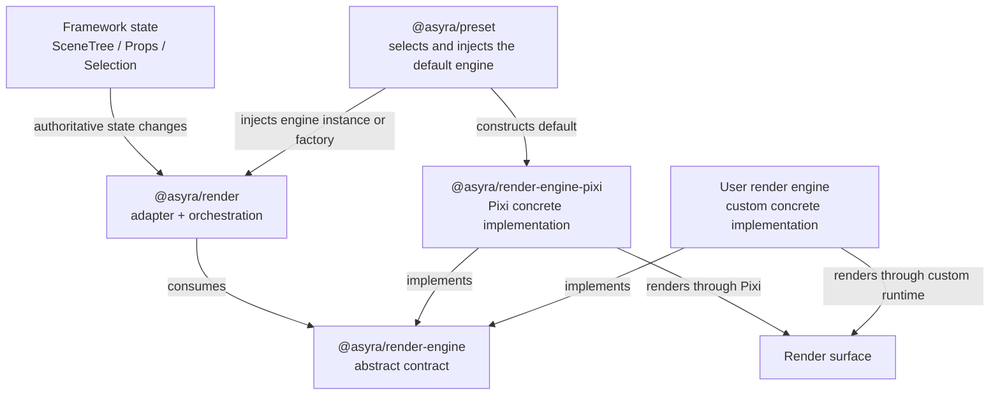

# Render-Engine Boundary Plan

## Status and Roadmap Position

First near-term architecture plan after transaction closeout.

This plan must complete before generic preset composition can accept a concrete
engine factory and before any official `2d`, `3d`, or `hybrid` preset profile is
considered. It defines render-engine replaceability while keeping
`@asyra/render` as the stable framework render package.

This phase focuses only on the existing Pixi-backed 2D behavior. It does not
implement or advertise a production 3D engine or hybrid runtime.

## Goal

Refactor the current `@asyra/render` package into three explicit ownership
layers without renaming the existing public package:

- `@asyra/render`: framework adapter and render orchestration;
- `@asyra/render-engine`: abstract engine contract;
- `@asyra/render-engine-pixi`: default Pixi concrete implementation.

Apps keep using the framework render APIs while preset startup injects Pixi by
default. A user can replace Pixi by implementing the abstract engine contract
without changing non-render framework packages.

## Target Package Architecture

Dependency rules represented by this diagram:

- `@asyra/render` depends on `@asyra/render-engine` only;
- `@asyra/render-engine-pixi` depends on `@asyra/render-engine` only;
- `@asyra/render` must not depend on `@asyra/render-engine-pixi` in the final
  architecture;
- `@asyra/render-engine-pixi` must not depend on `@asyra/render`;
- `@asyra/preset` is the default composition owner that constructs Pixi and
  injects it into `@asyra/render`;
- non-render packages consume core/render abstractions and do not access a
  concrete engine directly.

## Package Ownership

### `@asyra/render`

Owns framework-to-engine adaptation and render orchestration:

- state subscriptions and state-to-render routing;
- render instance and layer lifecycle;
- render strategies and projections;
- framework target id to opaque engine-handle mapping;
- viewport and render-facing framework APIs;
- render interaction targets and interaction bridge;
- create, update, remove, flush, resize, and destroy orchestration;
- invocation of the injected engine contract.

Must not own:

- Pixi imports or Pixi resource types;
- concrete engine construction after preset/app injection is available;
- engine-specific branches such as `if (pixi)` or `if (three)`;
- authoritative scene, props, selection, or app-domain state.

### `@asyra/render-engine`

Owns the abstract contract implemented by concrete engines:

- engine and surface lifecycle types;
- engine-neutral command and result contracts;
- opaque object and resource handles;
- resource lifecycle contracts needed by current render behavior;
- normalized engine interaction events;
- explicit capability identifiers and unsupported-capability errors;
- contract-test utilities only when they are engine-independent.

Must not own:

- Pixi, Three.js, DOM, or another engine SDK;
- framework state subscriptions, render layers, or feature behavior;
- a default singleton engine runtime;
- speculative 3D or hybrid APIs without a concrete engine and formal use case.

### `@asyra/render-engine-pixi`

Owns the default concrete implementation:

- Pixi application, surface, container, graphics, and resource lifecycle;
- translation of abstract commands into Pixi operations;
- Pixi object mapping behind opaque engine handles;
- Pixi batching and render execution;
- Pixi hit testing and event normalization required by the abstract contract;
- Pixi-specific cleanup and failure handling.

Must not own:

- framework state subscriptions;
- product feature decisions;
- app-domain geometry or interaction policy;
- render-layer orchestration;
- imports from `@asyra/render` that create a dependency cycle.

### `@asyra/preset`

Owns optional default composition:

- constructs an instance or factory for `@asyra/render-engine-pixi`;
- injects the selected engine into `@asyra/render` during startup;
- preserves the compatibility behavior of `applyPreset(core)`;
- allows an app to replace the default through an explicit startup contract.

Preset does not become the runtime owner of the renderer or engine.

## Canonical Runtime Flows

### State to render surface

1. Authoritative state changes in its owning package.
2. `@asyra/render` receives the change and resolves the affected projection or
   layer.
3. `@asyra/render` produces engine-neutral operations.
4. The injected implementation executes the `@asyra/render-engine` contract.
5. `@asyra/render-engine-pixi` updates the Pixi surface by default.

### Surface interaction to feature

1. The selected concrete engine receives a low-level surface event.
2. The engine performs only contract-owned hit testing or event normalization.
3. The engine returns an abstract event and opaque target handle to
   `@asyra/render`.
4. `@asyra/render` maps the handle to the framework interaction target and
   publishes through the existing interaction bridge.
5. Input/Feature owns the product decision and follows the canonical
   `Input -> Feature -> API -> State -> Render/UI` flow.

The concrete engine must never call product features directly.

## Active Inspector Authority

The exact package and data-flow contract for this plan is:

- Inspector data:
  `docs/ai/framework/plans/render-engine-boundary-flow-inspector.data.cjs`;
- direct-open viewer:
  `docs/ai/framework/plans/render-engine-boundary-flow-inspector.html`;
- target semantic gate:
  `docs/ai/framework/plans/render-engine-boundary-flow-inspector.contract.test.cjs`.

This plan remains the product and public-boundary authority. The Inspector maps
engine selection, Core startup, render adaptation, concrete execution,
interaction return, readiness, and cleanup without redefining product behavior.

## Baseline Migration Inventory

The extraction starts from these current ownership facts:

- `@asyra/render` publicly exports the default `render` singleton, `Render`,
  renderer lifecycle types, render strategy/layer/interaction surfaces, fill and
  projection helpers, stores, and the Pixi-specific `PixiJSRenderer`;
- Pixi runtime imports currently occur in the render lifecycle, scene,
  viewport, selection and overlay layers, render strategies, fill resources,
  mesh projection, interaction event types, and their concrete tests;
- Core owns `setRenderer(...)`, `start(...)`, framework-facing render APIs, and
  the injected `Render` dependency used by state/render bridges;
- Preset owns default render layers and subscriptions but does not yet select or
  inject a concrete engine;
- Asyra Design currently constructs `PixiJSRenderer` directly in its render-app
  bootstrap after `applyPreset(core)` has registered framework defaults.

The target classification is fixed by `Package Ownership`: orchestration,
registries, state synchronization, and framework interaction stay in
`@asyra/render`; abstract lifecycle, command, handle, resource, event,
capability, error, and contract-test types move to `@asyra/render-engine`; all
Pixi runtime objects and SDK calls move to `@asyra/render-engine-pixi`; preset
selects the default; Core and apps remain concrete-engine-neutral.

## Scope

In scope:

- inventory and classify all current `@asyra/render` public exports and Pixi
  dependencies;
- create the `@asyra/render-engine` abstract package;
- create the `@asyra/render-engine-pixi` concrete package;
- keep `@asyra/render` and migrate it to abstract engine consumption;
- define explicit engine instance/factory injection and lifecycle ownership;
- preserve the observable behavior of current Pixi-backed apps;
- provide a fake/contract-test engine that proves the boundary without
  pretending to be a production 3D engine;
- migrate Pixi-specific public exports through the deprecation lifecycle;
- update the engine-SDK import boundary and add an enforcement gate;
- update all framework and app documentation affected by the new architecture.

Out of scope:

- renaming `@asyra/render` to `@asyra/renderer`;
- a production 3D engine;
- official `2d`, `3d`, or `hybrid` preset profiles;
- multi-engine surface, camera, coordinate, hit-test, selection, or input
  coordination;
- app-specific visual style or domain policy;
- scene-tree, props-manager, selection, or feature-system ownership changes;
- speculative engine APIs added only for possible future modes.

## Contract Direction

### Abstract engine contract

The final API must be derived from current Pixi-backed product cases and the
fake contract engine. It should cover only behavior required by formal cases,
such as:

- initialize and destroy;
- surface creation and resize;
- create, update, remove, and render/flush operations;
- opaque object/resource handles;
- normalized interaction events and engine-level hit-test results;
- explicit capability query and unsupported-capability failure;
- deterministic resource cleanup.

The Inspector must decide exact inputs, outputs, failure ownership, and bypass
conditions before implementation. Do not lock a universal 2D/3D object model
from speculation.

### Engine injection

- `@asyra/render` consumes an injected abstract engine instance;
- preset startup should prefer a factory when it must create isolated renderer
  instances and engine lifecycles;
- direct class consumers may inject an engine instance;
- default module-level composition may still share the default runtime where
  that is the existing documented behavior;
- a custom render instance must not silently fall back to the default Pixi
  singleton.

### Capability behavior

- capabilities are explicit, extensible identifiers backed by real engine
  behavior or formal contract cases;
- layers declare required capabilities through the abstract contract;
- unsupported behavior fails deterministically according to the declared
  contract;
- no layer accesses concrete engine methods to bypass capability validation;
- this phase does not add 3D or hybrid capabilities.

## Compatibility and Deprecation Lifecycle

`@asyra/render` remains active and is not deprecated or renamed.

Pixi-specific exports currently exposed from `@asyra/render` follow a narrower
migration lifecycle:

1. Active

- keep existing behavior until `@asyra/render-engine-pixi` provides the tested
  replacement.

2. Deprecated

- migrate framework and app callers to the new concrete package;
- add `@deprecated` API documentation and a warn-once path where applicable;
- document the exact replacement import.

3. Compatibility-only

- allow only regression/security fixes on the old export;
- a temporary re-export that causes `@asyra/render` to reference the Pixi
  package is an explicit transition exception, not the completed boundary.

4. Removed

- remove the compatibility export in an explicitly planned release after the
  migration window;
- remove `pixi.js` and concrete Pixi packages from `@asyra/render` dependencies;
- enforce that only `@asyra/render-engine-pixi` imports `pixi.js`.

The plan is not complete while the final `@asyra/render` runtime still requires
Pixi or a compatibility re-export remains the normal startup path.

## Implementation Slices

### 1. Product contract, Inspector, and inventory

- inventory every public export, internal Pixi dependency, render layer,
  interaction path, resource lifecycle, and startup owner;
- define the thin product contract and exact Inspector flow for output and
  interaction routes;
- establish formal compatibility, negative, cleanup, and instance-isolation
  cases;
- classify every current responsibility into render, abstract engine, concrete
  Pixi engine, preset, core, or app ownership.

### 2. Abstract `@asyra/render-engine` package

- add engine-neutral types, lifecycle, handles, commands, events, capabilities,
  errors, and contract-test surface;
- keep the package free from engine SDKs and framework runtime ownership;
- prove current tests fail if a concrete engine type leaks into the contract.

### 3. Pixi `@asyra/render-engine-pixi` package

- move concrete Pixi lifecycle and operations behind the abstract contract;
- move Pixi-specific tests to the concrete package;
- keep current visual output and interaction behavior unchanged;
- ensure the concrete package does not depend on `@asyra/render`.

### 4. `@asyra/render` adapter refactor

- migrate orchestration, layers, projections, handles, and interaction bridge to
  the abstract contract;
- inject the engine instance/factory explicitly;
- remove engine-specific branches and normal-path Pixi imports;
- preserve current core-facing behavior.

### 5. Core/preset startup integration

- make preset construct and inject `@asyra/render-engine-pixi` by default;
- expose the bounded custom-engine startup path without requiring app patches;
- verify each custom render instance owns the intended engine instance;
- preserve `applyPreset(core)` and existing Asyra Design startup behavior.

### 6. Compatibility migration

- migrate internal and app imports of Pixi-specific exports;
- deprecate only the replaced Pixi-specific surfaces, not `@asyra/render`;
- provide and test the documented compatibility path;
- define the removal release and stop new dependencies on deprecated exports.

### 7. Contract and integration verification

- implement a fake/contract-test engine that records lifecycle, commands,
  handles, events, and cleanup;
- verify engine swap without changes in non-render packages;
- cover create/update/remove, layers, viewport, hit testing, interaction,
  undo/redo, load/save, local shared-channel projection, failure cleanup, and
  instance isolation;
- run synchronized Asyra Design visual regression and live-app verification
  against the Pixi implementation.

### 8. Framework documentation and architecture diagram sync

Update the current framework source-of-truth only after the implementation and
formal tests establish the new boundary:

- `docs/ai/framework/FRAMEWORK_ESSENTIALS.md`;
- `docs/ai/framework/ARCHITECTURE.md`;
- `docs/ai/framework/API_SURFACES.md`;
- `docs/ai/framework/RUNTIME_MATRICES.md`;
- `docs/ai/framework/CONSTRAINTS.md`;
- `docs/ai/framework/CODING_STANDARDS.md`;
- `docs/ai/framework/WORKFLOW.md`;
- `docs/ai/framework/rules/import-boundaries.md`;
- `docs/ai/framework/packages/render.md`;
- new package docs for `render-engine` and `render-engine-pixi`;
- affected Core, Preset, app bootstrap, and golden-path documents;
- Framework decision history and package migration guidance.

The `Target Package Architecture` Mermaid diagram in this plan must be copied
or adapted into `docs/ai/framework/ARCHITECTURE.md`, then reviewed against the
implemented package dependencies. Package docs may include smaller local
diagrams, but they must not redefine the ownership shown here.

### 9. Boundary enforcement and closeout

- change the Pixi import rule from the current `@asyra/render` owner to
  `@asyra/render-engine-pixi` only after the implementation is migrated;
- add deterministic dependency/import checks for the new package directions;
- remove transitional exceptions required only by the migration;
- run full package tests, app E2E, lint, build, and visual gates;
- archive the plan only when docs, diagram, code, tests, and dependency gates
  describe the same boundary.

## Product Cases

- existing `applyPreset(core)` boots the same Pixi-backed Asyra Design runtime;
- framework state produces the same visible output through the extracted Pixi
  engine;
- a fake engine receives equivalent lifecycle and semantic render operations;
- a custom engine can be injected without modifying non-render packages;
- multiple Render instances can own isolated engine instances;
- a missing required capability fails without concrete-engine introspection;
- engine failure cleans owned resources and does not publish a false ready
  state;
- Pixi events normalize through render interaction targets before Feature
  execution;
- undo/redo, load, persistence replay, and local shared projection remain
  renderer/engine consistent;
- no official 3D or hybrid behavior is exposed.

## Definition of Done

- `@asyra/render` remains the public adapter/orchestration package;
- `@asyra/render-engine` is engine-independent and has no concrete SDK;
- `@asyra/render-engine-pixi` owns all normal-path Pixi runtime behavior;
- `@asyra/render` has no normal-path Pixi dependency or engine-specific branch;
- preset injects Pixi by default and supports bounded custom-engine injection;
- render and concrete engine packages do not depend on one another directly;
- the fake engine proves replaceability and failure cleanup;
- Asyra Design output and interaction behavior remain compatible;
- Pixi-specific legacy exports have an enforced migration state;
- current framework docs contain the implemented architecture diagram and
  package ownership contracts;
- no placeholder 3D/hybrid engine, capability, or preset profile exists;
- focused and full tests, build, lint, import-boundary checks, E2E, and visual
  verification pass.

## Risks

1. Contract becomes a lowest-common-denominator graphics API.

- Derive it from current product cases and add capabilities only with a concrete
  engine and formal use case.

2. `@asyra/render` and Pixi implementation form a dependency cycle.

- Put shared commands, handles, events, and capabilities in
  `@asyra/render-engine`; enforce both package directions.

3. Temporary compatibility exports prevent true extraction.

- Treat them as versioned migration exceptions and exclude them from the final
  boundary definition.

4. Adapter indirection regresses performance.

- Profile before optimization and require semantic equivalence for batching or
  cache changes.

5. Engine-level interaction bypasses Feature ownership.

- Normalize low-level engine events into render interaction targets and keep
  product decisions in Input/Feature.

6. The diagram and current architecture documentation drift from code.

- Make documentation and diagram sync an explicit implementation slice and a
  closeout gate.
